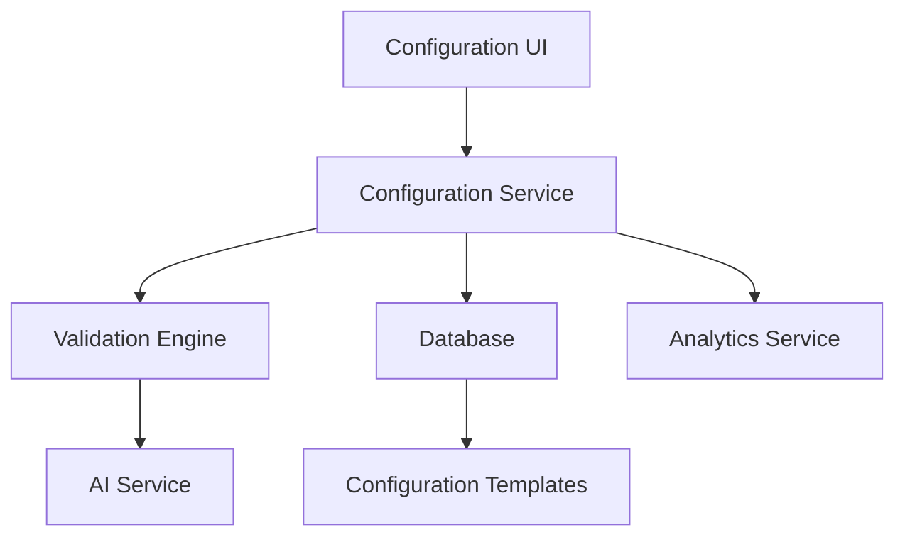

# Product Requirements Document: AI Configuration Management

## PRD-AIC-001

**Version:** 1.0  
**Date:** December 2024  
**Author:** AI Assistant  
**Status:** Draft  

---

## Executive Summary

This PRD outlines the requirements for implementing a comprehensive AI configuration management system that allows users to customize and fine-tune their AI Dungeon Master experience. The system will provide intuitive controls for adjusting AI behavior, personality, rules enforcement, and performance settings.

## Business Objectives

- Enable users to customize AI Dungeon Master behavior
- Provide granular control over AI personality and style
- Support different play styles and preferences
- Ensure AI reliability and performance optimization
- Create a user-friendly configuration experience

## Success Metrics

- **User Adoption:** 80% of users customize AI settings
- **Configuration Success:** > 95% successful configuration saves
- **AI Performance:** Improved response quality with custom settings
- **User Satisfaction:** > 90% satisfaction with AI customization options

---

## Detailed Requirements

### 1. Functional Requirements

#### 1.1 AI Personality Configuration
- **AIC-FR-001:** AI personality trait selection and customization
- **AIC-FR-002:** Narrative style preferences (formal, casual, dramatic)
- **AIC-FR-003:** Tone adjustment (serious, humorous, mysterious)
- **AIC-FR-004:** Communication style preferences
- **AIC-FR-005:** Custom personality prompts and instructions

#### 1.2 Rules and Gameplay Settings
- **AIC-FR-006:** D&D rules enforcement level (strict, moderate, flexible)
- **AIC-FR-007:** Combat encounter difficulty adjustment
- **AIC-FR-008:** Puzzle complexity preferences
- **AIC-FR-009:** Roleplay intensity settings
- **AIC-FR-010:** Player agency vs. DM guidance balance

#### 1.3 Performance and Response Settings
- **AIC-FR-011:** Response length preferences (brief, detailed, variable)
- **AIC-FR-012:** Response speed vs. quality trade-off
- **AIC-FR-013:** Creativity level adjustment
- **AIC-FR-014:** Context awareness settings
- **AIC-FR-015:** Memory and conversation history management

#### 1.4 Model and Technical Configuration
- **AIC-FR-016:** AI model selection (when multiple models available)
- **AIC-FR-017:** Temperature and randomness controls
- **AIC-FR-018:** Token limit and response length caps
- **AIC-FR-019:** Fallback model configuration
- **AIC-FR-020:** API endpoint and authentication settings

#### 1.5 Content and Safety Settings
- **AIC-FR-021:** Content appropriateness filters
- **AIC-FR-022:** Language and terminology preferences
- **AIC-FR-023:** Cultural sensitivity settings
- **AIC-FR-024:** Age-appropriate content controls
- **AIC-FR-025:** Custom content guidelines

#### 1.6 Preset Configurations
- **AIC-FR-026:** Pre-built configuration templates
- **AIC-FR-027:** Community-shared configuration presets
- **AIC-FR-028:** Campaign-specific AI profiles
- **AIC-FR-029:** Character-based AI adjustments
- **AIC-FR-030:** Quick setup wizards for common preferences

### 2. Technical Requirements

#### 2.1 User Interface Design
- **AIC-TR-001:** Intuitive configuration dashboard
- **AIC-TR-002:** Progressive disclosure of advanced options
- **AIC-TR-003:** Real-time preview of configuration changes
- **AIC-TR-004:** Mobile-responsive design
- **AIC-TR-005:** Accessibility compliance

#### 2.2 Configuration Management
- **AIC-TR-006:** Configuration persistence and versioning
- **AIC-TR-007:** Import/export configuration settings
- **AIC-TR-008:** Configuration backup and restore
- **AIC-TR-009:** Validation of configuration parameters
- **AIC-TR-010:** Conflict resolution for conflicting settings

#### 2.3 Integration with AI System
- **AIC-TR-011:** Dynamic configuration application
- **AIC-TR-012:** Configuration caching for performance
- **AIC-TR-013:** Real-time configuration updates
- **AIC-TR-014:** Configuration testing and validation
- **AIC-TR-015:** Performance monitoring and optimization

#### 2.4 Data Management
- **AIC-TR-016:** Configuration data storage and retrieval
- **AIC-TR-017:** User preference analytics
- **AIC-TR-018:** Configuration usage tracking
- **AIC-TR-019:** A/B testing framework for configurations
- **AIC-TR-020:** Configuration recommendation engine

---

## User Stories

### Primary User Stories

**As a player,** I want to customize my AI Dungeon Master's personality so that it matches my preferred play style.

**As a DM,** I want to adjust the AI's rules enforcement so that it fits my campaign's needs.

**As a player,** I want to control the AI's response length so that it doesn't overwhelm me with too much text.

**As a user,** I want to save and load different AI configurations so that I can use different settings for different campaigns.

**As a user,** I want to preview how my configuration changes will affect the AI so that I can make informed decisions.

### Secondary User Stories

**As a new user,** I want guided setup wizards so that I can quickly configure the AI for my needs.

**As a user,** I want to share my AI configurations with others so that we can have consistent experiences.

**As a user,** I want to see analytics about my AI interactions so that I can optimize my settings.

**As a user,** I want to reset to default settings if I make a mistake so that I can start over easily.

**As a developer,** I want to test different AI configurations so that I can improve the system.

---

## Technical Specifications

### Architecture



### Data Models

#### AI Configuration
```typescript
interface AIConfiguration {
  id: string;
  userId: string;
  campaignId?: string;
  name: string;
  description?: string;
  
  // Personality settings
  personality: PersonalitySettings;
  
  // Gameplay settings
  gameplay: GameplaySettings;
  
  // Performance settings
  performance: PerformanceSettings;
  
  // Model settings
  model: ModelSettings;
  
  // Content settings
  content: ContentSettings;
  
  // Metadata
  isDefault: boolean;
  isActive: boolean;
  version: number;
  createdAt: Date;
  updatedAt: Date;
}

interface PersonalitySettings {
  traits: PersonalityTrait[];
  narrativeStyle: NarrativeStyle;
  tone: Tone;
  communicationStyle: CommunicationStyle;
  customPrompts: CustomPrompt[];
}

interface GameplaySettings {
  rulesEnforcement: RulesEnforcementLevel;
  combatDifficulty: DifficultyLevel;
  puzzleComplexity: ComplexityLevel;
  roleplayIntensity: IntensityLevel;
  playerAgency: AgencyLevel;
}
```

#### Configuration Templates
```typescript
interface ConfigurationTemplate {
  id: string;
  name: string;
  description: string;
  category: TemplateCategory;
  configuration: Partial<AIConfiguration>;
  isOfficial: boolean;
  createdBy?: string;
  usageCount: number;
  rating: number;
  tags: string[];
}

enum TemplateCategory {
  BEGINNER = 'beginner',
  EXPERIENCED = 'experienced',
  CASUAL = 'casual',
  SERIOUS = 'serious',
  COMBAT_FOCUSED = 'combat_focused',
  ROLEPLAY_FOCUSED = 'roleplay_focused',
  CUSTOM = 'custom'
}
```

### API Endpoints

#### Configuration Management
- `GET /api/ai-configurations` - List user configurations
- `POST /api/ai-configurations` - Create new configuration
- `GET /api/ai-configurations/:id` - Get configuration details
- `PUT /api/ai-configurations/:id` - Update configuration
- `DELETE /api/ai-configurations/:id` - Delete configuration

#### Configuration Operations
- `POST /api/ai-configurations/:id/activate` - Activate configuration
- `POST /api/ai-configurations/:id/test` - Test configuration
- `POST /api/ai-configurations/:id/clone` - Clone configuration
- `POST /api/ai-configurations/:id/export` - Export configuration
- `POST /api/ai-configurations/import` - Import configuration

#### Template Management
- `GET /api/ai-configurations/templates` - List configuration templates
- `GET /api/ai-configurations/templates/:id` - Get template details
- `POST /api/ai-configurations/templates/:id/use` - Use template
- `POST /api/ai-configurations/templates` - Create custom template

#### Analytics
- `GET /api/ai-configurations/:id/analytics` - Get configuration analytics
- `GET /api/ai-configurations/analytics/popular` - Get popular configurations
- `POST /api/ai-configurations/:id/rate` - Rate configuration

---

## Implementation Plan

### Phase 1: Core Configuration System (Week 1-2)
1. Implement basic configuration data models
2. Create configuration CRUD operations
3. Build basic configuration UI
4. Add configuration validation

### Phase 2: Personality and Style Settings (Week 3)
1. Implement personality trait system
1. Add narrative style controls
2. Create tone and communication settings
3. Build custom prompt system

### Phase 3: Advanced Configuration (Week 4)
1. Add gameplay and performance settings
2. Implement model configuration
3. Create content and safety controls
4. Build configuration testing system

### Phase 4: Templates and Analytics (Week 5)
1. Implement configuration templates
2. Add configuration analytics
3. Create preset management
4. Build recommendation system

---

## Acceptance Criteria

### Functional Acceptance Criteria
- [ ] Users can create, edit, and delete AI configurations
- [ ] Personality traits affect AI behavior noticeably
- [ ] Configuration changes apply immediately
- [ ] Templates provide good starting points
- [ ] Advanced settings are accessible but not overwhelming
- [ ] Configuration testing works reliably

### Technical Acceptance Criteria
- [ ] Configuration changes save successfully > 95% of time
- [ ] Configuration loading is fast (< 1 second)
- [ ] Real-time preview works without lag
- [ ] Configuration validation prevents invalid states
- [ ] Analytics data is accurate and useful
- [ ] System handles multiple configurations efficiently

### Quality Assurance Criteria
- [ ] Unit test coverage > 85% for configuration logic
- [ ] Integration tests for configuration workflows
- [ ] Manual testing with various configuration combinations
- [ ] Performance testing with multiple active configurations
- [ ] User experience testing for configuration usability

---

## Dependencies

### External Dependencies
- **AI Service:** For configuration application and testing
- **Analytics Service:** For usage tracking and recommendations
- **Validation Library:** For configuration parameter validation

### Internal Dependencies
- **User Management:** For user-specific configurations
- **Campaign Service:** For campaign-specific settings
- **Database:** For configuration storage

### Risks and Mitigations

#### Risk: Configuration complexity overwhelms users
**Mitigation:** Progressive disclosure and guided wizards

#### Risk: Configuration changes break AI behavior
**Mitigation:** Configuration validation and testing system

#### Risk: Performance impact from frequent changes
**Mitigation:** Caching and efficient update mechanisms

---

## Testing Strategy

### Unit Testing
- Configuration validation logic
- Personality setting calculations
- Template application logic
- Configuration serialization

### Integration Testing
- Complete configuration workflows
- AI service integration
- Configuration persistence
- Real-time updates

### User Acceptance Testing
- Configuration usability testing
- AI behavior changes validation
- Template effectiveness testing
- Performance impact assessment

### Performance Testing
- Configuration loading times
- Real-time update performance
- Memory usage with multiple configurations
- Database query performance

---

## Success Metrics and KPIs

### Technical KPIs
- **Performance:** < 1 second configuration load time
- **Reliability:** > 95% successful configuration saves
- **Efficiency:** < 10% performance impact from configurations
- **Compatibility:** 100% backward compatibility with existing configs

### Business KPIs
- **User Engagement:** 80% of users customize AI settings
- **Satisfaction:** > 90% satisfaction with customization options
- **Retention:** Increased user retention through personalization
- **Feature Usage:** 70% of sessions use custom configurations

---

## Future Considerations

### Phase 2 Features (Post-MVP)
- AI learning from user feedback
- Dynamic configuration recommendations
- Configuration sharing marketplace
- Advanced analytics and insights
- Configuration optimization suggestions

### Advanced Features
- Machine learning-based personalization
- Collaborative configuration building
- Real-time A/B testing of configurations
- Advanced prompt engineering tools
- Configuration versioning and rollback

---

## Approval and Sign-off

**Product Manager:** [To be assigned]  
**Technical Lead:** [To be assigned]  
**QA Lead:** [To be assigned]  
**Design Lead:** [To be assigned]

**Approval Date:** [Date]  
**Target Launch Date:** [Date + 5 weeks]
