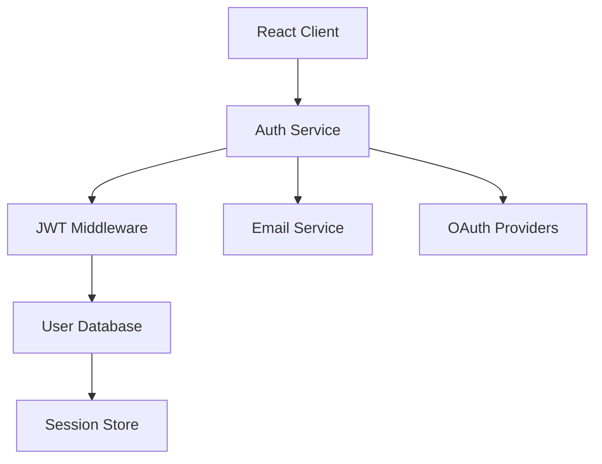

# Product Requirements Document: Authentication & User Management

## PRD-AUM-001

**Version:** 1.0  
**Date:** December 2024  
**Author:** AI Assistant  
**Status:** Draft  

---

## Executive Summary

This PRD outlines the requirements for implementing a comprehensive authentication and user management system that enables secure user registration, login, and profile management. The system will support multiple authentication methods, user profiles, and role-based access control for the D&D campaign platform.

## Business Objectives

- Provide secure user authentication and authorization
- Enable user account management and personalization
- Support multiplayer campaign functionality
- Ensure data privacy and security compliance
- Create a seamless user onboarding experience

## Success Metrics

- **Security:** Zero security breaches or unauthorized access incidents
- **User Adoption:** 95% of users successfully complete registration
- **Authentication Success:** > 99% successful login attempts
- **User Satisfaction:** > 90% satisfaction with user management features

---

## Detailed Requirements

### 1. Functional Requirements

#### 1.1 User Registration and Authentication
- **AUM-FR-001:** User registration with email verification
- **AUM-FR-002:** Secure password requirements and validation
- **AUM-FR-003:** Multiple login methods (email/password, social login)
- **AUM-FR-004:** Password reset and recovery functionality
- **AUM-FR-005:** Account email verification system

#### 1.2 User Profile Management
- **AUM-FR-006:** User profile creation and editing
- **AUM-FR-007:** Avatar/profile picture upload and management
- **AUM-FR-008:** User preferences and settings
- **AUM-FR-009:** Privacy settings and data sharing controls
- **AUM-FR-010:** Account deletion and data export

#### 1.3 Session Management
- **AUM-FR-011:** Secure session handling with JWT tokens
- **AUM-FR-012:** Automatic session timeout and renewal
- **AUM-FR-013:** Concurrent session management
- **AUM-FR-014:** Remember me functionality
- **AUM-FR-015:** Device management and logout

#### 1.4 Role-Based Access Control
- **AUM-FR-016:** User role definitions (player, DM, admin)
- **AUM-FR-017:** Permission-based access to features
- **AUM-FR-018:** Campaign-specific role assignments
- **AUM-FR-019:** Administrative user management
- **AUM-FR-020:** Guest access for campaign previews

#### 1.5 Security Features
- **AUM-FR-021:** Password encryption and secure storage
- **AUM-FR-022:** Rate limiting for authentication attempts
- **AUM-FR-023:** Suspicious activity detection
- **AUM-FR-024:** Two-factor authentication (2FA) support
- **AUM-FR-025:** Security audit logging

#### 1.6 User Experience
- **AUM-FR-026:** Intuitive registration and login flows
- **AUM-FR-027:** Clear error messages and validation feedback
- **AUM-FR-028:** Mobile-friendly authentication interface
- **AUM-FR-029:** Progressive enhancement for accessibility
- **AUM-FR-030:** Multi-language support preparation

### 2. Technical Requirements

#### 2.1 Frontend Integration
- **AUM-TR-001:** React authentication components
- **AUM-TR-002:** Protected route implementation
- **AUM-TR-003:** User context and state management
- **AUM-TR-004:** Form validation and error handling

#### 2.2 Backend Security
- **AUM-TR-005:** JWT token implementation
- **AUM-TR-006:** Password hashing with bcrypt
- **AUM-TR-007:** Rate limiting middleware
- **AUM-TR-008:** Input sanitization and validation

#### 2.3 Database Design
- **AUM-TR-009:** Secure user data storage
- **AUM-TR-010:** Session management tables
- **AUM-TR-011:** Role and permission schemas
- **AUM-TR-012:** Audit logging system

#### 2.4 Third-Party Integrations
- **AUM-TR-013:** OAuth provider integrations
- **AUM-TR-014:** Email service integration
- **AUM-TR-015:** Security monitoring services
- **AUM-TR-016:** Backup and recovery systems

---

## User Stories

### Primary User Stories

**As a new user,** I want to create an account so that I can start playing D&D campaigns.

**As a user,** I want to securely log in to my account so that I can access my characters and campaigns.

**As a user,** I want to manage my profile so that I can personalize my gaming experience.

**As a user,** I want to reset my password so that I can regain access if I forget it.

**As a campaign organizer,** I want to invite players to my campaign so that we can play together.

### Secondary User Stories

**As a user,** I want to enable two-factor authentication so that my account is more secure.

**As a user,** I want to see my login history so that I can monitor account activity.

**As a DM,** I want to manage player permissions in my campaign so that I control access levels.

**As an administrator,** I want to manage user accounts so that I can help users with issues.

**As a user,** I want to export my data so that I can backup my account information.

---

## Technical Specifications

### Architecture



### Data Models

#### User Account
```typescript
interface User {
  id: string;
  email: string;
  username: string;
  displayName: string;
  passwordHash: string;
  emailVerified: boolean;
  emailVerificationToken?: string;
  passwordResetToken?: string;
  passwordResetExpires?: Date;
  avatar?: string;
  bio?: string;
  theme: 'light' | 'dark';
  notifications: boolean;
  twoFactorEnabled: boolean;
  twoFactorSecret?: string;
  roles: UserRole[];
  lastLoginAt?: Date;
  loginCount: number;
  createdAt: Date;
  updatedAt: Date;
}

enum UserRole {
  PLAYER = 'player',
  DM = 'dm',
  ADMIN = 'admin'
}
```

#### Session Management
```typescript
interface UserSession {
  id: string;
  userId: string;
  token: string;
  deviceInfo: DeviceInfo;
  ipAddress: string;
  userAgent: string;
  expiresAt: Date;
  createdAt: Date;
  lastActivityAt: Date;
}

interface DeviceInfo {
  type: 'desktop' | 'mobile' | 'tablet';
  os: string;
  browser: string;
  location?: string;
}
```

#### User Permissions
```typescript
interface CampaignPermission {
  id: string;
  campaignId: string;
  userId: string;
  role: CampaignRole;
  permissions: Permission[];
  grantedBy: string;
  grantedAt: Date;
}

enum CampaignRole {
  OWNER = 'owner',
  DM = 'dm',
  PLAYER = 'player',
  SPECTATOR = 'spectator'
}

enum Permission {
  VIEW_CAMPAIGN = 'view_campaign',
  EDIT_CAMPAIGN = 'edit_campaign',
  MANAGE_PLAYERS = 'manage_players',
  DELETE_CAMPAIGN = 'delete_campaign',
  CAST_SPELLS = 'cast_spells',
  ROLL_DICE = 'roll_dice'
}
```

### API Endpoints

#### Authentication
- `POST /api/auth/register` - User registration
- `POST /api/auth/login` - User login
- `POST /api/auth/logout` - User logout
- `POST /api/auth/refresh` - Token refresh
- `POST /api/auth/verify-email` - Email verification
- `POST /api/auth/forgot-password` - Password reset request
- `POST /api/auth/reset-password` - Password reset

#### User Management
- `GET /api/users/profile` - Get user profile
- `PUT /api/users/profile` - Update user profile
- `POST /api/users/avatar` - Upload avatar
- `DELETE /api/users/avatar` - Delete avatar
- `GET /api/users/sessions` - Get active sessions
- `DELETE /api/users/sessions/:id` - Revoke session

#### Two-Factor Authentication
- `POST /api/auth/2fa/enable` - Enable 2FA
- `POST /api/auth/2fa/disable` - Disable 2FA
- `POST /api/auth/2fa/verify` - Verify 2FA code
- `POST /api/auth/2fa/generate-backup` - Generate backup codes

#### Administrative
- `GET /api/admin/users` - List all users
- `GET /api/admin/users/:id` - Get user details
- `PUT /api/admin/users/:id` - Update user
- `DELETE /api/admin/users/:id` - Delete user
- `POST /api/admin/users/:id/impersonate` - Impersonate user

---

## Implementation Plan

### Phase 1: Core Authentication (Week 1-2)
1. Implement user registration and login
2. Set up JWT token system
3. Create password hashing and validation
4. Build basic user profile management

### Phase 2: Security Enhancements (Week 3)
1. Add email verification system
2. Implement password reset functionality
3. Set up rate limiting and security middleware
4. Create session management

### Phase 3: Advanced Features (Week 4)
1. Add OAuth social login integrations
2. Implement two-factor authentication
3. Build role-based access control
4. Create administrative user management

### Phase 4: Integration and Testing (Week 5)
1. Integrate with existing campaign system
2. Add multiplayer campaign permissions
3. Comprehensive security testing
4. User acceptance testing

---

## Acceptance Criteria

### Functional Acceptance Criteria
- [ ] Users can register, verify email, and login securely
- [ ] Password reset and recovery works correctly
- [ ] User profiles can be created and updated
- [ ] Role-based permissions control access appropriately
- [ ] Session management works across devices
- [ ] Two-factor authentication is fully functional

### Technical Acceptance Criteria
- [ ] JWT tokens are securely generated and validated
- [ ] Passwords are properly hashed and stored
- [ ] Rate limiting prevents brute force attacks
- [ ] All authentication endpoints are protected
- [ ] Session data is encrypted and secure

### Quality Assurance Criteria
- [ ] Security audit passes with no critical vulnerabilities
- [ ] Penetration testing shows no exploitable weaknesses
- [ ] Unit test coverage > 95% for authentication logic
- [ ] Integration tests for complete auth workflows
- [ ] Manual security testing by qualified personnel

---

## Dependencies

### External Dependencies
- **JWT Library:** For token management
- **bcrypt:** For password hashing
- **OAuth Providers:** Google, Discord, etc.
- **Email Service:** SendGrid, AWS SES, etc.

### Internal Dependencies
- **Database Models:** User and session schemas
- **Campaign System:** For permission integration
- **Real-time System:** For live session updates

### Risks and Mitigations

#### Risk: Security vulnerabilities
**Mitigation:** Security audit, penetration testing, code review

#### Risk: User data privacy concerns
**Mitigation:** GDPR compliance, data encryption, clear privacy policy

#### Risk: Authentication service downtime
**Mitigation:** Redundant systems, failover mechanisms

---

## Testing Strategy

### Unit Testing
- Password hashing and validation
- JWT token generation and verification
- User permission logic
- Session management functions

### Integration Testing
- Complete registration and login flow
- Password reset workflow
- Social login integrations
- Role-based access control

### Security Testing
- Penetration testing
- Vulnerability scanning
- Authentication bypass attempts
- Session hijacking prevention

### User Acceptance Testing
- Registration and login usability
- Password reset functionality
- Profile management interface
- Multi-device session handling

---

## Success Metrics and KPIs

### Technical KPIs
- **Security:** Zero successful unauthorized access attempts
- **Performance:** < 200ms authentication response time
- **Reliability:** 99.9% authentication success rate
- **Scalability:** Support 10,000+ concurrent users

### Business KPIs
- **User Acquisition:** 95% registration completion rate
- **User Retention:** < 5% account abandonment rate
- **Security Incidents:** Zero security breaches
- **User Satisfaction:** > 90% satisfaction with auth system

---

## Future Considerations

### Phase 2 Features (Post-MVP)
- Biometric authentication
- Magic link authentication
- Account linking and merging
- Advanced user analytics
- Community features integration

### Advanced Features
- Single sign-on (SSO) integration
- Advanced security monitoring
- Automated threat detection
- User behavior analytics
- Compliance reporting tools

---

## Approval and Sign-off

**Product Manager:** [To be assigned]  
**Technical Lead:** [To be assigned]  
**QA Lead:** [To be assigned]  
**Design Lead:** [To be assigned]

**Approval Date:** [Date]  
**Target Launch Date:** [Date + 5 weeks]
