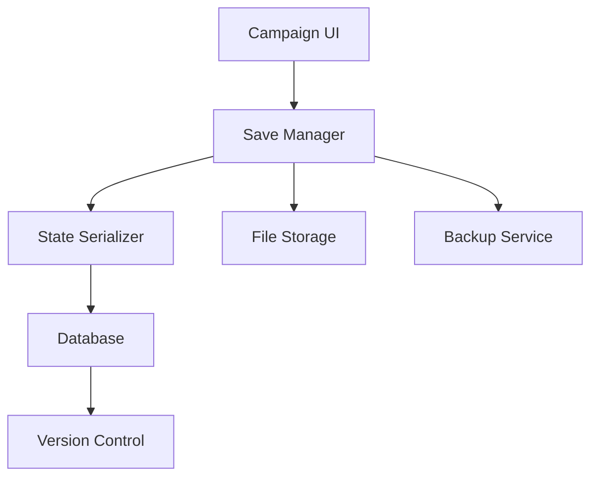

# Product Requirements Document: Campaign Resume/Save System

## PRD-CRS-001

**Version:** 1.0  
**Date:** December 2024  
**Author:** AI Assistant  
**Status:** Draft  

---

## Executive Summary

This PRD outlines the requirements for implementing a comprehensive campaign save and resume system that allows players to preserve their campaign progress and seamlessly continue gameplay sessions. The system will provide automatic saving, manual checkpoints, and robust state management for D&D campaigns.

## Business Objectives

- Enable players to save and resume campaigns at any point
- Preserve all campaign state and progress reliably
- Support long-term campaign continuity
- Provide flexible save management options
- Ensure data integrity across save and resume operations

## Success Metrics

- **Data Integrity:** 100% campaign state preservation
- **Save Success Rate:** > 99.9% successful save operations
- **Resume Success Rate:** > 99.5% successful resume operations
- **User Satisfaction:** > 95% satisfaction with save/resume functionality

---

## Detailed Requirements

### 1. Functional Requirements

#### 1.1 Automatic Saving
- **CRS-FR-001:** Automatic campaign state saves every 5 minutes
- **CRS-FR-002:** Save on significant game events (combat, major decisions)
- **CRS-FR-003:** Background saving without interrupting gameplay
- **CRS-FR-004:** Save progress indicators for user awareness
- **CRS-FR-005:** Conflict resolution for concurrent modifications

#### 1.2 Manual Save Points
- **CRS-FR-006:** Manual save functionality accessible to players
- **CRS-FR-007:** Named save points with custom descriptions
- **CRS-FR-008:** Save before major story moments or combat
- **CRS-FR-009:** Quick save and quick load shortcuts
- **CRS-FR-010:** Save confirmation and overwrite warnings

#### 1.3 Campaign State Management
- **CRS-FR-011:** Complete campaign data preservation
- **CRS-FR-012:** Character state and inventory at save point
- **CRS-FR-013:** Chat history and conversation context
- **CRS-FR-014:** Active spell effects and durations
- **CRS-FR-015:** Combat state and initiative order

#### 1.4 Resume Functionality
- **CRS-FR-016:** Campaign selection from saved games list
- **CRS-FR-017:** Resume from last automatic save
- **CRS-FR-018:** Load from specific named save points
- **CRS-FR-019:** State restoration with progress indicators
- **CRS-FR-020:** Resume session with all participants

#### 1.5 Save Management
- **CRS-FR-021:** Save file organization and categorization
- **CRS-FR-022:** Save deletion with confirmation
- **CRS-FR-023:** Save export and backup functionality
- **CRS-FR-024:** Storage space management and warnings
- **CRS-FR-025:** Save file search and filtering

#### 1.6 Multiplayer Synchronization
- **CRS-FR-026:** Consistent save state across all players
- **CRS-FR-027:** Player progress synchronization on resume
- **CRS-FR-028:** Handle player disconnections during saves
- **CRS-FR-029:** Resume with different player combinations
- **CRS-FR-030:** Campaign ownership and access control

### 2. Technical Requirements

#### 2.1 Data Persistence
- **CRS-TR-001:** Robust database storage for campaign states
- **CRS-TR-002:** Efficient data serialization and compression
- **CRS-TR-003:** Backup and recovery mechanisms
- **CRS-TR-004:** Data integrity validation on save/load
- **CRS-TR-005:** Version control for save file compatibility

#### 2.2 Frontend Integration
- **CRS-TR-006:** Seamless save/resume UI integration
- **CRS-TR-007:** Progress indicators for long operations
- **CRS-TR-008:** Error handling and recovery interfaces
- **CRS-TR-009:** Offline save capability
- **CRS-TR-010:** Real-time synchronization status

#### 2.3 Backend Architecture
- **CRS-TR-011:** Asynchronous save operations
- **CRS-TR-012:** Queue management for save requests
- **CRS-TR-013:** Conflict resolution algorithms
- **CRS-TR-014:** Performance monitoring and optimization
- **CRS-TR-015:** Scalable storage architecture

#### 2.4 Performance Requirements
- **CRS-TR-016:** Save operations complete in < 3 seconds
- **CRS-TR-017:** Resume operations complete in < 5 seconds
- **CRS-TR-018:** Minimal memory usage during save operations
- **CRS-TR-019:** Background processing doesn't impact gameplay
- **CRS-TR-020:** Efficient storage utilization

---

## User Stories

### Primary User Stories

**As a player,** I want my campaign progress to be automatically saved so that I don't lose my progress if something goes wrong.

**As a player,** I want to manually save my campaign at important moments so that I can return to specific points in the story.

**As a player,** I want to resume my campaign from where I left off so that I can continue my adventure seamlessly.

**As a DM,** I want to ensure all players can resume the campaign with the correct state so that we maintain campaign continuity.

**As a player,** I want to manage my saved campaigns so that I can organize and find my different adventures.

### Secondary User Stories

**As a player,** I want to see save progress so that I know my progress is being preserved.

**As a player,** I want to create named save points so that I can mark significant moments in my campaign.

**As a player,** I want to export my campaign saves so that I can backup my progress.

**As a DM,** I want to control save permissions so that I can manage campaign flow.

**As a player,** I want to see how much storage my saves are using so that I can manage my space.

---

## Technical Specifications

### Architecture



### Data Models

#### Save Metadata
```typescript
interface CampaignSave {
  id: string;
  campaignId: string;
  saveType: SaveType;
  name?: string;
  description?: string;
  createdBy: string;
  createdAt: Date;
  fileSize: number;
  checksum: string;
  version: string;
  isCompressed: boolean;
}

enum SaveType {
  AUTOMATIC = 'automatic',
  MANUAL = 'manual',
  QUICK_SAVE = 'quick_save',
  CHECKPOINT = 'checkpoint'
}
```

#### Campaign State Snapshot
```typescript
interface CampaignStateSnapshot {
  campaign: Campaign;
  characters: Character[];
  gameState: GameState;
  chatHistory: ChatMessage[];
  activeSpells: ActiveSpell[];
  inventoryState: InventorySnapshot[];
  playerStates: PlayerState[];
  metadata: {
    saveVersion: string;
    campaignVersion: string;
    playerCount: number;
    lastActivity: Date;
    totalPlayTime: number;
  };
}

interface PlayerState {
  userId: string;
  characterId?: string;
  isOnline: boolean;
  lastSeen: Date;
  permissions: string[];
}
```

#### Save Configuration
```typescript
interface SaveConfiguration {
  autoSaveInterval: number; // minutes
  maxAutoSaves: number;
  maxManualSaves: number;
  compressionEnabled: boolean;
  backupEnabled: boolean;
  backupFrequency: string; // daily, weekly, monthly
  storageLimit: number; // MB
  conflictResolution: ConflictResolutionStrategy;
}

enum ConflictResolutionStrategy {
  LATEST_WINS = 'latest_wins',
  MANUAL_RESOLUTION = 'manual_resolution',
  MERGE_CHANGES = 'merge_changes'
}
```

### API Endpoints

#### Save Operations
- `POST /api/campaigns/:id/save` - Create manual save
- `POST /api/campaigns/:id/autosave` - Trigger automatic save
- `POST /api/campaigns/:id/quick-save` - Create quick save
- `GET /api/campaigns/:id/saves` - List campaign saves
- `GET /api/campaigns/:id/saves/:saveId` - Get save details

#### Resume Operations
- `POST /api/campaigns/:id/resume/:saveId` - Resume from save
- `GET /api/campaigns/:id/last-save` - Get last save information
- `POST /api/campaigns/:id/resume-latest` - Resume from latest save
- `GET /api/campaigns/resume-options` - Get available campaigns to resume

#### Save Management
- `DELETE /api/campaigns/:id/saves/:saveId` - Delete save
- `POST /api/campaigns/:id/saves/:saveId/export` - Export save
- `POST /api/campaigns/:id/saves/:saveId/duplicate` - Duplicate save
- `PUT /api/campaigns/:id/saves/:saveId` - Update save metadata

#### Configuration
- `GET /api/campaigns/:id/save-config` - Get save configuration
- `PUT /api/campaigns/:id/save-config` - Update save configuration
- `POST /api/campaigns/:id/save-config/reset` - Reset to default config

---

## Implementation Plan

### Phase 1: Core Save System (Week 1-2)
1. Implement basic save and load functionality
2. Create campaign state serialization
3. Build save metadata management
4. Develop automatic save triggers

### Phase 2: Resume Functionality (Week 3)
1. Implement campaign resume workflow
2. Add state restoration logic
3. Create save selection interface
4. Build conflict resolution system

### Phase 3: Advanced Features (Week 4)
1. Manual save points with naming
2. Save export and backup functionality
3. Storage management and cleanup
4. Performance optimization

### Phase 4: Multiplayer Integration (Week 5)
1. Multiplayer state synchronization
2. Player permission management
3. Real-time save status updates
4. Comprehensive testing

---

## Acceptance Criteria

### Functional Acceptance Criteria
- [ ] Campaigns save automatically every 5 minutes
- [ ] Manual saves can be created with custom names
- [ ] Campaigns can be resumed from any save point
- [ ] Save operations complete without interrupting gameplay
- [ ] All campaign state is preserved accurately
- [ ] Save conflicts are resolved appropriately

### Technical Acceptance Criteria
- [ ] Save operations complete in < 3 seconds
- [ ] Resume operations complete in < 5 seconds
- [ ] Data integrity is maintained across save/load cycles
- [ ] Storage usage is optimized and monitored
- [ ] System handles concurrent save requests
- [ ] Error recovery works for failed save operations

### Quality Assurance Criteria
- [ ] Unit test coverage > 90% for save/load logic
- [ ] Integration tests for complete save workflows
- [ ] Performance testing with large campaign states
- [ ] Manual testing with various save scenarios
- [ ] Data integrity testing across multiple save/load cycles

---

## Dependencies

### External Dependencies
- **Database System:** For campaign state storage
- **File Storage:** For save file management
- **Compression Library:** For efficient storage
- **Backup Service:** For data protection

### Internal Dependencies
- **Campaign Service:** For campaign data access
- **Character Service:** For character state management
- **Real-time System:** For multiplayer synchronization

### Risks and Mitigations

#### Risk: Data corruption during save operations
**Mitigation:** Data validation, checksums, and backup systems

#### Risk: Performance impact during saves
**Mitigation:** Asynchronous processing and background operations

#### Risk: Storage space limitations
**Mitigation:** Compression, cleanup policies, and user warnings

---

## Testing Strategy

### Unit Testing
- State serialization and deserialization
- Save metadata management
- Conflict resolution algorithms
- Storage quota management

### Integration Testing
- Complete save and resume workflows
- Multiplayer save synchronization
- Automatic save triggers
- Error handling and recovery

### Performance Testing
- Save operation speed with various campaign sizes
- Concurrent save request handling
- Storage usage patterns
- Resume time with complex states

### User Acceptance Testing
- Save and resume usability testing
- Performance with real campaign scenarios
- Error handling user experience
- Storage management interface

---

## Success Metrics and KPIs

### Technical KPIs
- **Performance:** < 3 second save time, < 5 second resume time
- **Reliability:** > 99.9% save success rate, > 99.5% resume success rate
- **Data Integrity:** 100% state preservation accuracy
- **Storage Efficiency:** < 50% storage overhead for compression

### Business KPIs
- **User Retention:** Reduced campaign abandonment by 30%
- **User Satisfaction:** > 95% satisfaction with save system
- **Feature Usage:** 90% of campaigns use save functionality
- **Recovery Success:** 95% of interrupted sessions successfully resumed

---

## Future Considerations

### Phase 2 Features (Post-MVP)
- Cloud save synchronization
- Save sharing between players
- Save branching and alternative storylines
- Save analytics and campaign insights
- Mobile save optimization

### Advanced Features
- Real-time collaborative saves
- Save compression optimization
- Advanced backup strategies
- Save file encryption
- Cross-platform save compatibility

---

## Approval and Sign-off

**Product Manager:** [To be assigned]  
**Technical Lead:** [To be assigned]  
**QA Lead:** [To be assigned]  
**Design Lead:** [To be assigned]

**Approval Date:** [Date]  
**Target Launch Date:** [Date + 5 weeks]
