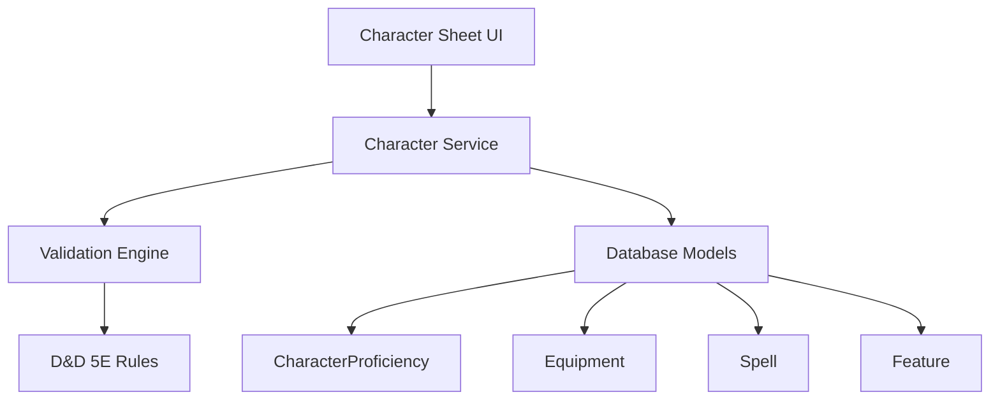

# Product Requirements Document: Character Sheet Management

## PRD-CSM-001

**Version:** 1.0  
**Date:** December 2024  
**Author:** AI Assistant  
**Status:** Draft  

---

## Executive Summary

This PRD outlines the requirements for implementing a comprehensive character sheet management system that allows players to view, edit, and manage their D&D 5E character's equipment, spells, proficiencies, and other mechanical details. The system will provide an intuitive interface for character customization and reference during gameplay.

## Business Objectives

- Enable players to fully customize and manage their D&D characters
- Provide easy access to character information during gameplay
- Ensure data integrity and validation for character mechanics
- Support character progression and equipment management
- Create a professional, game-accurate character sheet experience

## Success Metrics

- **User Satisfaction:** > 90% user satisfaction with character sheet usability
- **Data Accuracy:** 100% compliance with D&D 5E character creation rules
- **Feature Adoption:** 95% of users complete their character sheets
- **Error Rate:** < 2% user-reported issues with character data

---

## Detailed Requirements

### 1. Functional Requirements

#### 1.1 Character Overview
- **CSM-FR-001:** Complete character summary with all core stats
- **CSM-FR-002:** Character portrait/avatar management
- **CSM-FR-003:** Background and personality trait display
- **CSM-FR-004:** Character level and experience tracking
- **CSM-FR-005:** Alignment and faith information

#### 1.2 Ability Scores and Modifiers
- **CSM-FR-006:** Display of all six ability scores (STR, DEX, CON, INT, WIS, CHA)
- **CSM-FR-007:** Automatic modifier calculations
- **CSM-FR-008:** Saving throw modifiers with proficiency indicators
- **CSM-FR-009:** Ability score improvement tracking
- **CSM-FR-010:** Racial ability modifiers and bonuses

#### 1.3 Proficiencies and Skills
- **CSM-FR-011:** Skill proficiency management with checkboxes
- **CSM-FR-012:** Skill modifier calculations (ability + proficiency + other bonuses)
- **CSM-FR-013:** Tool and language proficiency tracking
- **CSM-FR-014:** Armor and weapon proficiency lists
- **CSM-FR-015:** Proficiency bonus calculation by level

#### 1.4 Equipment and Inventory
- **CSM-FR-016:** Equipment list with item details and quantities
- **CSM-FR-017:** Armor management with AC calculations
- **CSM-FR-018:** Weapon tracking with attack/damage modifiers
- **CSM-FR-019:** Item categorization (weapons, armor, tools, etc.)
- **CSM-FR-020:** Equipment weight and encumbrance tracking

#### 1.5 Spell Management
- **CSM-FR-021:** Spell list organized by level
- **CSM-FR-022:** Spell slot tracking with usage indicators
- **CSM-FR-023:** Spell component requirements
- **CSM-FR-024:** Prepared spell management for spellcasters
- **CSM-FR-025:** Cantrip management with unlimited usage

#### 1.6 Features and Traits
- **CSM-FR-026:** Racial features and abilities
- **CSM-FR-027:** Class features by level
- **CSM-FR-028:** Background features
- **CSM-FR-029:** Feat tracking and management
- **CSM-FR-030:** Feature descriptions and mechanics

#### 1.7 Character Progression
- **CSM-FR-031:** Level-up interface with ability score improvements
- **CSM-FR-032:** New feature acquisition tracking
- **CSM-FR-033:** Spell slot increases at appropriate levels
- **CSM-FR-034:** Proficiency bonus updates
- **CSM-FR-035:** Hit die management

### 2. Technical Requirements

#### 2.1 Frontend Components
- **CSM-TR-001:** React components for character sheet interface
- **CSM-TR-002:** Form validation for character data
- **CSM-TR-003:** Responsive design for mobile compatibility
- **CSM-TR-004:** Print-friendly character sheet layout

#### 2.2 Backend Integration
- **CSM-TR-005:** RESTful API for character data management
- **CSM-TR-006:** Data validation against D&D 5E rules
- **CSM-TR-007:** Character data persistence and backup
- **CSM-TR-008:** Real-time sync with campaign sessions

#### 2.3 Data Management
- **CSM-TR-009:** Character data export/import functionality
- **CSM-TR-010:** Version control for character changes
- **CSM-TR-011:** Bulk editing capabilities
- **CSM-TR-012:** Search and filter functionality

---

## User Stories

### Primary User Stories

**As a player,** I want to view my complete character sheet so that I can reference my stats during gameplay.

**As a player,** I want to manage my equipment and inventory so that I can track what my character is carrying.

**As a player,** I want to organize my spells by level so that I can easily find the right spell for any situation.

**As a player,** I want to track my proficiencies so that I know what skills my character is good at.

**As a player,** I want to level up my character so that I can advance in power and abilities.

### Secondary User Stories

**As a player,** I want to export my character sheet so that I can use it in other D&D tools or for backup.

**As a player,** I want to see my character's portrait so that I can feel more connected to my character.

**As a player,** I want to track my prepared spells so that I don't forget what I have available.

**As a player,** I want to see all my racial and class features so that I remember what abilities I have.

**As a DM,** I want to view player character sheets so that I can understand their capabilities.

---

## Technical Specifications

### Architecture



### Data Models

#### Character Sheet Structure
```typescript
interface CharacterSheet {
  // Core character info
  id: string;
  name: string;
  race: string;
  class: string;
  level: number;
  background: string;
  alignment: string;
  experience: number;
  
  // Ability scores
  abilities: {
    strength: AbilityScore;
    dexterity: AbilityScore;
    constitution: AbilityScore;
    intelligence: AbilityScore;
    wisdom: AbilityScore;
    charisma: AbilityScore;
  };
  
  // Combat stats
  hitPoints: HealthStats;
  armorClass: number;
  initiative: number;
  speed: number;
  proficiencyBonus: number;
  
  // Collections
  proficiencies: Proficiency[];
  equipment: EquipmentItem[];
  spells: Spell[];
  features: CharacterFeature[];
  
  // Metadata
  createdAt: Date;
  updatedAt: Date;
}
```

#### Equipment Management
```typescript
interface EquipmentItem {
  id: string;
  name: string;
  category: 'weapon' | 'armor' | 'tool' | 'consumable' | 'treasure';
  quantity: number;
  weight: number;
  value?: number;
  description: string;
  properties?: string[];
  equipped?: boolean;
  attuned?: boolean;
}
```

#### Spell Management
```typescript
interface Spell {
  id: string;
  name: string;
  level: number;
  school: string;
  castingTime: string;
  range: string;
  components: SpellComponents;
  duration: string;
  description: string;
  prepared: boolean;
  alwaysPrepared: boolean;
}

interface SpellComponents {
  verbal: boolean;
  somatic: boolean;
  material: string | null;
}
```

### API Endpoints

#### Character Management
- `GET /api/characters/:id` - Get complete character sheet
- `PUT /api/characters/:id` - Update character sheet
- `PATCH /api/characters/:id` - Partial character update
- `POST /api/characters/:id/level-up` - Level up character

#### Equipment Management
- `GET /api/characters/:id/equipment` - Get character equipment
- `POST /api/characters/:id/equipment` - Add equipment item
- `PUT /api/characters/:id/equipment/:itemId` - Update equipment item
- `DELETE /api/characters/:id/equipment/:itemId` - Remove equipment item

#### Spell Management
- `GET /api/characters/:id/spells` - Get character spells
- `POST /api/characters/:id/spells` - Add spell to character
- `PUT /api/characters/:id/spells/:spellId` - Update spell
- `DELETE /api/characters/:id/spells/:spellId` - Remove spell
- `PATCH /api/characters/:id/spells/:spellId/prepare` - Toggle spell preparation

#### Proficiency Management
- `GET /api/characters/:id/proficiencies` - Get character proficiencies
- `POST /api/characters/:id/proficiencies` - Add proficiency
- `DELETE /api/characters/:id/proficiencies/:profId` - Remove proficiency

---

## Implementation Plan

### Phase 1: Core Character Display (Week 1-2)
1. Create character sheet overview component
2. Implement ability scores and modifiers display
3. Add basic equipment and spell lists
4. Build proficiency management interface

### Phase 2: Equipment Management (Week 3)
1. Develop equipment CRUD interface
2. Implement inventory categorization
3. Add equipment weight and encumbrance
4. Create equipment search and filtering

### Phase 3: Spell Management (Week 4)
1. Build spell organization by level
2. Implement spell slot tracking
3. Add prepared spell management
4. Create spell search and filtering

### Phase 4: Advanced Features (Week 5)
1. Character progression system
2. Feature and trait management
3. Print-friendly layout
4. Export/import functionality

---

## Acceptance Criteria

### Functional Acceptance Criteria
- [ ] Character sheet displays all core stats accurately
- [ ] Equipment can be added, edited, and removed
- [ ] Spells are properly organized and tracked
- [ ] Proficiencies are correctly calculated and displayed
- [ ] Character level progression works correctly
- [ ] All data validates against D&D 5E rules

### Technical Acceptance Criteria
- [ ] Character data persists correctly across sessions
- [ ] Real-time updates work during gameplay
- [ ] Form validation prevents invalid data entry
- [ ] Performance remains smooth with large inventories
- [ ] Mobile-responsive design works on all screen sizes

### Quality Assurance Criteria
- [ ] Unit test coverage > 85% for character calculations
- [ ] Integration tests for character data flow
- [ ] Manual testing with various character builds
- [ ] Performance testing with complex characters

---

## Dependencies

### External Dependencies
- **D&D 5E SRD:** Official rule reference for validation
- **Character Sheet Templates:** Standard D&D character sheet format

### Internal Dependencies
- **Character Service:** For data persistence
- **Authentication System:** For user ownership (Future PRD)
- **Campaign Service:** For character-campaign associations

### Risks and Mitigations

#### Risk: Complex character data validation
**Mitigation:** Comprehensive rule validation engine and extensive testing

#### Risk: Performance issues with large spell lists
**Mitigation:** Efficient data structures and lazy loading

#### Risk: User confusion with complex interface
**Mitigation:** User testing and progressive disclosure of features

---

## Testing Strategy

### Unit Testing
- Character stat calculations
- Equipment weight and encumbrance
- Spell slot management
- Proficiency bonus calculations

### Integration Testing
- Complete character creation flow
- Equipment and spell management
- Character progression system
- Data persistence and retrieval

### User Acceptance Testing
- Character sheet usability testing
- Data accuracy validation
- Performance with complex characters
- Mobile compatibility testing

### Performance Testing
- Large inventory management
- Complex spell list handling
- Character data loading times
- Memory usage with detailed characters

---

## Success Metrics and KPIs

### Technical KPIs
- **Accuracy:** 100% compliance with D&D 5E rules
- **Performance:** < 1 second load time for character sheets
- **Reliability:** < 1% data corruption incidents
- **Scalability:** Support characters with 200+ items/spells

### Business KPIs
- **User Engagement:** Increased time spent managing characters
- **User Satisfaction:** > 90% satisfaction with character management
- **Completion Rate:** 95% of users complete character creation
- **Feature Usage:** 80% of users regularly update equipment

---

## Future Considerations

### Phase 2 Features (Post-MVP)
- Character builder wizard
- Automated stat calculations
- Character comparison tools
- Character sharing between players
- Character history and versioning

### Advanced Features
- Character optimization suggestions
- Automated leveling recommendations
- Character portrait generation
- Integration with external character builders
- Character statistics and analytics

---

## Approval and Sign-off

**Product Manager:** [To be assigned]  
**Technical Lead:** [To be assigned]  
**QA Lead:** [To be assigned]  
**Design Lead:** [To be assigned]

**Approval Date:** [Date]  
**Target Launch Date:** [Date + 5 weeks]
