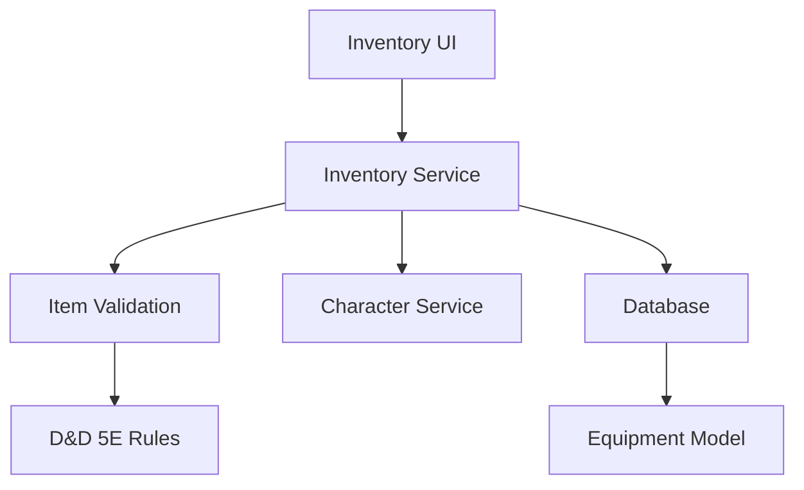

# Product Requirements Document: Inventory Management System

## PRD-IMS-001

**Version:** 1.0  
**Date:** December 2024  
**Author:** AI Assistant  
**Status:** Draft  

---

## Executive Summary

This PRD outlines the requirements for implementing a comprehensive inventory management system that allows players to track, organize, and manage their character's equipment and possessions. The system will provide an intuitive interface for inventory management with weight tracking, item categorization, and integration with gameplay mechanics.

## Business Objectives

- Enable players to effectively manage character equipment and possessions
- Provide accurate weight and encumbrance tracking for D&D 5E compliance
- Support organized inventory with categorization and search
- Integrate inventory with combat and spellcasting systems
- Create an engaging inventory management experience

## Success Metrics

- **User Adoption:** 90% of players regularly use inventory management
- **Data Accuracy:** 100% compliance with D&D 5E encumbrance rules
- **Performance:** < 500ms inventory loading and search response times
- **Error Rate:** < 1% user-reported inventory calculation errors

---

## Detailed Requirements

### 1. Functional Requirements

#### 1.1 Inventory Organization
- **IMS-FR-001:** Item categorization (weapons, armor, tools, consumables, treasure)
- **IMS-FR-002:** Custom container/item grouping support
- **IMS-FR-003:** Search and filter functionality by name, category, or properties
- **IMS-FR-004:** Item sorting by name, weight, value, or category
- **IMS-FR-005:** Bulk item operations (select multiple, move, delete)

#### 1.2 Item Management
- **IMS-FR-006:** Add items with quantity, weight, and value tracking
- **IMS-FR-007:** Edit item details (name, description, properties)
- **IMS-FR-008:** Item quantity management with stack handling
- **IMS-FR-009:** Item deletion with confirmation dialogs
- **IMS-FR-010:** Item duplication for identical items

#### 1.3 Equipment Integration
- **IMS-FR-011:** Equipment slot management (weapon, armor, accessories)
- **IMS-FR-012:** Equipped item indicators and quick unequip
- **IMS-FR-013:** Attunement tracking for magical items
- **IMS-FR-014:** Cursed item handling and warnings
- **IMS-FR-015:** Item property effects on character stats

#### 1.4 Weight and Encumbrance
- **IMS-FR-016:** Real-time weight calculation and display
- **IMS-FR-017:** Encumbrance level indicators (unencumbered, encumbered, heavily encumbered)
- **IMS-FR-018:** Carrying capacity calculations based on Strength score
- **IMS-FR-019:** Weight reduction effects (bags of holding, etc.)
- **IMS-FR-020:** Variant encumbrance rule support

#### 1.5 Item Information
- **IMS-FR-021:** Detailed item descriptions and properties
- **IMS-FR-022:** Item rarity and value display
- **IMS-FR-023:** Magical item properties and effects
- **IMS-FR-024:** Item source references (PHB, DMG, etc.)
- **IMS-FR-025:** Custom item creation and management

#### 1.6 User Experience
- **IMS-FR-026:** Drag-and-drop item organization
- **IMS-FR-027:** Keyboard shortcuts for common actions
- **IMS-FR-028:** Mobile-friendly touch interface
- **IMS-FR-029:** Item tooltips with quick information
- **IMS-FR-030:** Visual feedback for actions and state changes

### 2. Technical Requirements

#### 2.1 Frontend Components
- **IMS-TR-001:** React components for inventory interface
- **IMS-TR-002:** Drag-and-drop functionality implementation
- **IMS-TR-003:** Responsive design for mobile devices
- **IMS-TR-004:** Accessibility support for screen readers

#### 2.2 Backend Integration
- **IMS-TR-005:** RESTful API for inventory operations
- **IMS-TR-006:** Real-time inventory synchronization
- **IMS-TR-007:** Data validation for item properties
- **IMS-TR-008:** Performance optimization for large inventories

#### 2.3 Data Management
- **IMS-TR-009:** Efficient item data storage and retrieval
- **IMS-TR-010:** Item template system for common items
- **IMS-TR-011:** Inventory backup and export functionality
- **IMS-TR-012:** Search indexing for fast item lookup

---

## User Stories

### Primary User Stories

**As a player,** I want to organize my character's equipment so that I can easily find what I need during gameplay.

**As a player,** I want to track the weight of my items so that I know when I'm getting encumbered.

**As a player,** I want to equip and unequip items quickly so that I can adapt to different situations.

**As a player,** I want to search through my inventory so that I can find specific items when needed.

**As a player,** I want to see the total value of my possessions so that I can track my character's wealth.

### Secondary User Stories

**As a player,** I want to create custom items so that I can represent unique equipment from my campaign.

**As a player,** I want to see which items are magical so that I know which ones require attunement.

**As a player,** I want to group similar items together so that I can manage them efficiently.

**As a DM,** I want to see player inventories so that I can incorporate items into the story.

**As a player,** I want to export my inventory so that I can share it or keep backups.

---

## Technical Specifications

### Architecture



### Data Models

#### Item Structure
```typescript
interface InventoryItem {
  id: string;
  characterId: string;
  name: string;
  category: ItemCategory;
  quantity: number;
  weight: number; // in pounds
  value: number; // in copper pieces
  description: string;
  properties: ItemProperty[];
  rarity: ItemRarity;
  magical: boolean;
  requiresAttunement: boolean;
  attuned: boolean;
  equipped: boolean;
  equippedSlot?: EquipmentSlot;
  custom: boolean;
  source: string; // PHB, DMG, etc.
  createdAt: Date;
  updatedAt: Date;
}

enum ItemCategory {
  WEAPON = 'weapon',
  ARMOR = 'armor',
  TOOL = 'tool',
  CONSUMABLE = 'consumable',
  TREASURE = 'treasure',
  WONDROUS_ITEM = 'wondrous_item',
  CONTAINER = 'container'
}

enum EquipmentSlot {
  WEAPON_MAIN_HAND = 'weapon_main_hand',
  WEAPON_OFF_HAND = 'weapon_off_hand',
  ARMOR = 'armor',
  ACCESSORY_1 = 'accessory_1',
  ACCESSORY_2 = 'accessory_2',
  ACCESSORY_3 = 'accessory_3'
}
```

#### Inventory Management
```typescript
interface CharacterInventory {
  characterId: string;
  totalWeight: number;
  carryingCapacity: number;
  encumbranceLevel: EncumbranceLevel;
  totalValue: number;
  itemCount: number;
  containers: InventoryContainer[];
}

interface InventoryContainer {
  id: string;
  name: string;
  capacity: number;
  currentWeight: number;
  items: InventoryItem[];
}
```

### API Endpoints

#### Item Management
- `GET /api/characters/:id/inventory` - Get character inventory
- `POST /api/characters/:id/inventory/items` - Add item to inventory
- `PUT /api/characters/:id/inventory/items/:itemId` - Update inventory item
- `DELETE /api/characters/:id/inventory/items/:itemId` - Remove item from inventory
- `POST /api/characters/:id/inventory/items/:itemId/equip` - Equip/unequip item

#### Inventory Operations
- `GET /api/characters/:id/inventory/search` - Search inventory items
- `POST /api/characters/:id/inventory/bulk` - Bulk inventory operations
- `GET /api/characters/:id/inventory/weight` - Get encumbrance information
- `POST /api/characters/:id/inventory/export` - Export inventory data

#### Item Templates
- `GET /api/items/templates` - Get item templates
- `POST /api/items/templates` - Create custom item template
- `GET /api/items/search` - Search item database

---

## Implementation Plan

### Phase 1: Core Inventory System (Week 1-2)
1. Create inventory data models and API endpoints
2. Implement basic CRUD operations for items
3. Build item categorization and search
4. Develop weight calculation system

### Phase 2: Equipment Integration (Week 3)
1. Implement equipment slot system
2. Add equip/unequip functionality
3. Create attunement tracking
4. Integrate with character stats

### Phase 3: Advanced Features (Week 4)
1. Drag-and-drop organization
2. Bulk operations support
3. Custom item creation
4. Export/import functionality

### Phase 4: Polish and Optimization (Week 5)
1. Mobile optimization
2. Performance improvements
3. User testing and feedback
4. Documentation completion

---

## Acceptance Criteria

### Functional Acceptance Criteria
- [ ] Items can be added, edited, and removed from inventory
- [ ] Weight calculations are accurate and real-time
- [ ] Equipment can be equipped and unequipped properly
- [ ] Search and filtering work across all item properties
- [ ] Encumbrance levels are calculated and displayed correctly
- [ ] Item categorization and organization functions properly

### Technical Acceptance Criteria
- [ ] Inventory loads in < 500ms for characters with 100+ items
- [ ] Real-time updates work across all connected clients
- [ ] Data validation prevents invalid item configurations
- [ ] Mobile interface is fully functional and responsive
- [ ] All D&D 5E encumbrance rules are correctly implemented

### Quality Assurance Criteria
- [ ] Unit test coverage > 85% for inventory calculations
- [ ] Integration tests for complete inventory workflows
- [ ] Manual testing with various inventory sizes
- [ ] Performance testing with large item collections

---

## Dependencies

### External Dependencies
- **D&D 5E SRD:** Official item and encumbrance rules
- **Item Database:** Pre-populated with official D&D items

### Internal Dependencies
- **Character Service:** For character stat integration
- **Authentication System:** For user ownership
- **Real-time System:** For inventory synchronization

### Risks and Mitigations

#### Risk: Performance issues with large inventories
**Mitigation:** Efficient data structures and pagination

#### Risk: Complex item property interactions
**Mitigation:** Comprehensive validation and testing

#### Risk: Mobile usability challenges
**Mitigation:** Touch-optimized interface design

---

## Testing Strategy

### Unit Testing
- Weight and encumbrance calculations
- Item validation logic
- Equipment slot management
- Search and filtering algorithms

### Integration Testing
- Complete inventory management workflows
- Equipment integration with character stats
- Real-time synchronization
- Bulk operations functionality

### User Acceptance Testing
- Inventory management usability
- Performance with various inventory sizes
- Mobile device compatibility
- Accessibility compliance

### Performance Testing
- Large inventory loading times
- Search response times
- Memory usage with extensive item collections
- Network synchronization performance

---

## Success Metrics and KPIs

### Technical KPIs
- **Performance:** < 500ms inventory loading and search
- **Accuracy:** 100% compliance with D&D 5E rules
- **Reliability:** < 1% data inconsistency issues
- **Scalability:** Support inventories with 500+ items

### Business KPIs
- **User Engagement:** Increased time spent managing inventories
- **User Satisfaction:** > 90% satisfaction with inventory system
- **Feature Usage:** 90% of players use advanced inventory features
- **Data Quality:** < 1% user-reported inventory errors

---

## Future Considerations

### Phase 2 Features (Post-MVP)
- Item crafting system
- Magical item identification
- Container nesting support
- Item sharing between characters
- Inventory analytics and insights

### Advanced Features
- Automated loot distribution
- Item comparison tools
- Market price tracking
- Inventory optimization suggestions
- Integration with external item databases

---

## Approval and Sign-off

**Product Manager:** [To be assigned]  
**Technical Lead:** [To be assigned]  
**QA Lead:** [To be assigned]  
**Design Lead:** [To be assigned]

**Approval Date:** [Date]  
**Target Launch Date:** [Date + 5 weeks]
