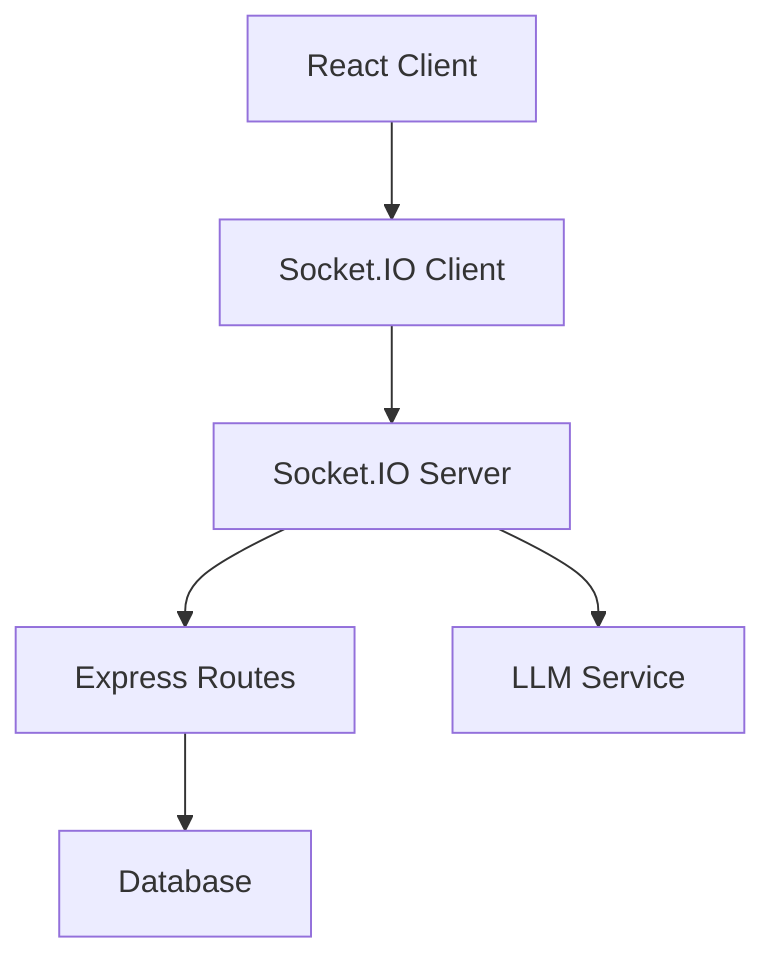

# Product Requirements Document: Real-Time Chat System

## PRD-RTC-001

**Version:** 1.0  
**Date:** December 2024  
**Author:** AI Assistant  
**Status:** Draft  

---

## Executive Summary

This PRD outlines the requirements for implementing a real-time chat system that enables live, interactive communication between players and the AI Dungeon Master during campaign gameplay. The system will leverage Socket.IO for real-time bidirectional communication, replacing the current polling-based approach.

## Business Objectives

- Enable real-time communication between players and the AI Dungeon Master
- Support multiplayer campaigns with live chat updates
- Reduce server load by eliminating constant polling
- Provide immediate feedback for player actions and DM responses
- Enhance the immersive gaming experience with instant messaging

## Success Metrics

- **Real-time Latency:** < 500ms response time for chat messages
- **Concurrent Users:** Support up to 10 simultaneous players per campaign
- **Message Reliability:** 99.9% message delivery success rate
- **User Satisfaction:** > 90% user satisfaction with chat responsiveness

---

## Detailed Requirements

### 1. Functional Requirements

#### 1.1 Real-Time Message Broadcasting
- **RTC-FR-001:** Players can send messages that are instantly broadcast to all participants in the same campaign
- **RTC-FR-002:** AI Dungeon Master responses are automatically broadcast to all players in real-time
- **RTC-FR-003:** System messages (dice rolls, skill checks, combat events) are broadcast instantly
- **RTC-FR-004:** Message history is synchronized across all connected clients

#### 1.2 Connection Management
- **RTC-FR-005:** Automatic reconnection with message history preservation on connection loss
- **RTC-FR-006:** Connection status indicators (online/offline/away) for all participants
- **RTC-FR-007:** Graceful handling of network interruptions with offline message queuing
- **RTC-FR-008:** Campaign room-based isolation (messages only visible to campaign participants)

#### 1.3 Message Types and Formatting
- **RTC-FR-009:** Support for multiple message types: player chat, DM responses, system notifications, dice rolls
- **RTC-FR-010:** Rich text formatting for DM responses (italics, bold, lists)
- **RTC-FR-011:** Dice roll result highlighting and formatting
- **RTC-FR-012:** Message timestamps with timezone awareness

#### 1.4 User Experience
- **RTC-FR-013:** Typing indicators showing when other players are composing messages
- **RTC-FR-014:** Read receipts and message delivery status
- **RTC-FR-015:** Auto-scroll to latest messages with manual scroll preservation
- **RTC-FR-016:** Message history pagination for long conversations

### 2. Technical Requirements

#### 2.1 Frontend Integration
- **RTC-TR-001:** React component using Socket.IO client library
- **RTC-TR-002:** State management integration with existing Redux/Context
- **RTC-TR-003:** Responsive design compatible with existing UI components
- **RTC-TR-004:** Error boundary handling for connection failures

#### 2.2 Backend Integration
- **RTC-TR-005:** Socket.IO server integration with existing Express app
- **RTC-TR-006:** Room-based message routing using campaign IDs
- **RTC-TR-007:** Database integration for message persistence
- **RTC-TR-008:** Authentication middleware for socket connections

#### 2.3 Performance Requirements
- **RTC-TR-009:** Horizontal scaling support for multiple server instances
- **RTC-TR-010:** Message rate limiting (max 10 messages per minute per user)
- **RTC-TR-011:** Memory-efficient message buffering for high-volume campaigns
- **RTC-TR-012:** Connection pooling and resource management

---

## User Stories

### Primary User Stories

**As a player,** I want to see other players' messages instantly so that I can participate in real-time conversations during the campaign.

**As a player,** I want to receive immediate DM responses so that the game feels interactive and engaging.

**As a DM (future feature),** I want to communicate with multiple players simultaneously so that I can manage group dynamics effectively.

**As a system administrator,** I want to monitor chat performance so that I can ensure optimal user experience.

### Secondary User Stories

**As a player,** I want to know when other players are typing so that I can expect incoming messages.

**As a player,** I want to see connection status of other participants so that I know who's actively participating.

**As a player,** I want my messages to be delivered reliably even during network issues so that I don't lose important communications.

---

## Technical Specifications

### Architecture



### Data Models

#### Socket Events
```typescript
interface SocketEvents {
  'join:campaign': (campaignId: string) => void;
  'leave:campaign': (campaignId: string) => void;
  'chat:message': (data: ChatMessageData) => void;
  'chat:update': (message: ChatMessage) => void;
  'user:typing': (data: TypingData) => void;
  'user:status': (status: UserStatus) => void;
}
```

#### Message Data Structure
```typescript
interface ChatMessageData {
  campaignId: string;
  message: string;
  type: 'player' | 'dm' | 'system';
  metadata?: Record<string, any>;
}

interface ChatMessage {
  id: string;
  campaignId: string;
  speaker: string;
  message: string;
  type: string;
  timestamp: Date;
  metadata?: string; // JSON string
}
```

### API Endpoints

#### Existing Endpoints (to be enhanced)
- `POST /api/campaigns/:id/chat` - Send chat message
- `GET /api/campaigns/:id` - Get campaign with chat history

#### New Real-Time Events
- `join:campaign` - Join campaign room
- `leave:campaign` - Leave campaign room
- `chat:message` - Send message to room
- `chat:update` - Receive message from room
- `user:typing` - Typing indicator
- `user:status` - User status updates

---

## Implementation Plan

### Phase 1: Core Infrastructure (Week 1-2)
1. Install Socket.IO client and server libraries
2. Set up Socket.IO server integration
3. Implement basic room-based messaging
4. Add connection management

### Phase 2: Frontend Integration (Week 3)
1. Create Socket.IO React hook
2. Integrate with existing chat component
3. Add typing indicators and status
4. Implement error handling

### Phase 3: Enhanced Features (Week 4)
1. Message persistence and history sync
2. Rich text formatting
3. Performance optimizations
4. Testing and QA

### Phase 4: Production Deployment (Week 5)
1. Load testing
2. Monitoring setup
3. Documentation
4. User acceptance testing

---

## Acceptance Criteria

### Functional Acceptance Criteria
- [ ] Players can send and receive messages in real-time
- [ ] AI DM responses appear instantly for all players
- [ ] Message history is preserved across reconnections
- [ ] System properly handles network interruptions
- [ ] Messages are isolated to correct campaign rooms

### Technical Acceptance Criteria
- [ ] Socket.IO client integrated with React components
- [ ] Server handles up to 100 concurrent connections
- [ ] Message delivery latency < 500ms
- [ ] Memory usage remains stable under load
- [ ] All existing functionality continues to work

### Quality Assurance Criteria
- [ ] Unit test coverage > 80% for new components
- [ ] Integration tests for Socket.IO functionality
- [ ] Cross-browser compatibility (Chrome, Firefox, Safari)
- [ ] Mobile responsiveness maintained
- [ ] Accessibility compliance (WCAG 2.1 AA)

---

## Dependencies

### External Dependencies
- **Socket.IO:** Real-time communication library
- **Socket.IO Client:** React integration library

### Internal Dependencies
- **Campaign Service:** For room-based isolation
- **Authentication System:** For user identification (Future PRD)
- **Database Models:** ChatMessage and Campaign models

### Risks and Mitigations

#### Risk: High server load during peak usage
**Mitigation:** Implement rate limiting and connection pooling

#### Risk: Message loss during network issues
**Mitigation:** Implement offline queuing and retry mechanisms

#### Risk: Compatibility issues with existing code
**Mitigation:** Comprehensive testing and gradual rollout

---

## Testing Strategy

### Unit Testing
- Socket.IO event handlers
- Message formatting functions
- Connection management logic

### Integration Testing
- End-to-end message flow
- Room isolation verification
- Authentication integration

### Performance Testing
- Concurrent user load testing
- Message throughput testing
- Memory usage monitoring

### User Acceptance Testing
- Real-time chat functionality
- Message history preservation
- Error handling scenarios

---

## Success Metrics and KPIs

### Technical KPIs
- **Latency:** < 500ms average response time
- **Reliability:** 99.9% message delivery rate
- **Scalability:** Support 100+ concurrent users
- **Performance:** < 100MB memory usage per 1000 connections

### Business KPIs
- **User Engagement:** Increased session duration by 25%
- **User Satisfaction:** > 90% positive feedback on chat responsiveness
- **Retention:** Reduced bounce rate by 15%
- **Feature Adoption:** 80% of active users use real-time chat within 30 days

---

## Future Considerations

### Phase 2 Features (Post-MVP)
- Voice chat integration
- File/image sharing in chat
- Message reactions and threading
- Advanced moderation tools
- Chat analytics and insights

### Scalability Considerations
- Redis adapter for multi-server deployments
- Message archiving and cleanup policies
- CDN integration for static assets
- Global deployment considerations

---

## Approval and Sign-off

**Product Manager:** [To be assigned]  
**Technical Lead:** [To be assigned]  
**QA Lead:** [To be assigned]  
**Design Lead:** [To be assigned]

**Approval Date:** [Date]  
**Target Launch Date:** [Date + 5 weeks]
