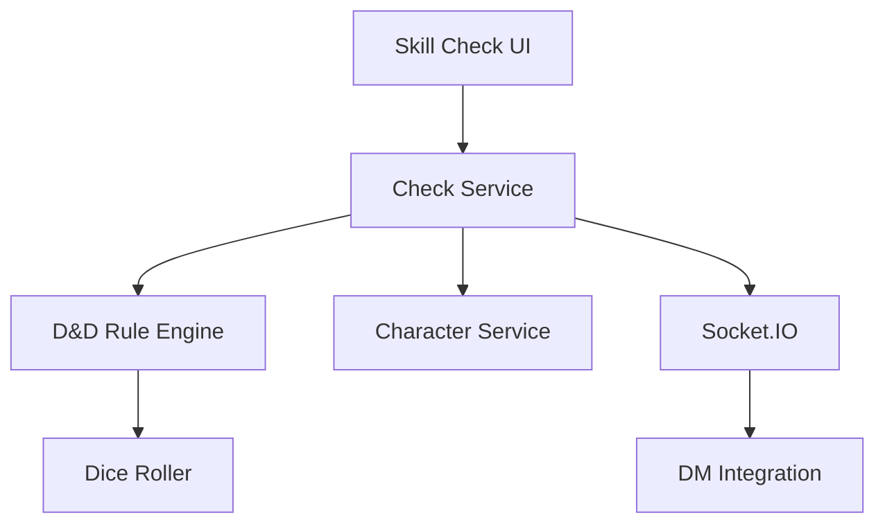

# Product Requirements Document: Skill Checks & Saving Throws UI

## PRD-SCS-001

**Version:** 1.0  
**Date:** December 2024  
**Author:** AI Assistant  
**Status:** Draft  

---

## Executive Summary

This PRD outlines the requirements for implementing an intuitive user interface for skill checks and saving throws in D&D 5E gameplay. The system will provide players with easy access to their character's abilities, automatic calculation of modifiers, and seamless integration with the AI Dungeon Master for resolving checks.

## Business Objectives

- Enable players to quickly and accurately perform skill checks during gameplay
- Provide clear, D&D 5E compliant saving throw mechanics
- Reduce player confusion with intuitive interfaces
- Maintain game flow with fast resolution times
- Support both manual and automated resolution methods

## Success Metrics

- **Resolution Speed:** Average skill check completion in < 30 seconds
- **User Satisfaction:** > 90% user satisfaction with check interfaces
- **Accuracy:** 100% compliance with D&D 5E modifier calculations
- **Error Rate:** < 3% user-reported calculation errors

---

## Detailed Requirements

### 1. Functional Requirements

#### 1.1 Skill Check Interface
- **SCS-FR-001:** Quick access to all character skills with current modifiers
- **SCS-FR-002:** Skill proficiency indicators (proficient/non-proficient)
- **SCS-FR-003:** Automatic modifier calculation (ability + proficiency + other bonuses)
- **SCS-FR-004:** Advantage/disadvantage toggle with visual indicators
- **SCS-FR-005:** Custom modifier input for situational bonuses

#### 1.2 Saving Throw Interface
- **SCS-FR-006:** Dedicated saving throw buttons for all six abilities
- **SCS-FR-007:** Proficiency highlighting for proficient saves
- **SCS-FR-008:** Automatic saving throw modifier calculation
- **SCS-FR-009:** Advantage/disadvantage support for saves
- **SCS-FR-010:** Death saving throw interface with success/failure tracking

#### 1.3 Check Resolution
- **SCS-FR-011:** Automatic d20 roll generation with result display
- **SCS-FR-012:** Total calculation (roll + modifiers) with breakdown
- **SCS-FR-013:** Critical success/failure detection and highlighting
- **SCS-FR-014:** Result broadcasting to DM and other players
- **SCS-FR-015:** Check result history and logging

#### 1.4 DM Integration
- **SCS-FR-016:** Difficulty Class (DC) setting by DM
- **SCS-FR-017:** Success/failure determination and messaging
- **SCS-FR-018:** Contextual check descriptions from DM
- **SCS-FR-019:** Passive check support (no roll required)
- **SCS-FR-020:** Group check coordination

#### 1.5 User Experience
- **SCS-FR-021:** Keyboard shortcuts for common checks
- **SCS-FR-022:** Quick roll buttons for frequently used skills
- **SCS-FR-023:** Check result animations and feedback
- **SCS-FR-024:** Mobile-friendly touch interface
- **SCS-FR-025:** Accessibility support for screen readers

### 2. Technical Requirements

#### 2.1 Frontend Components
- **SCS-TR-001:** React components for skill/saving throw interfaces
- **SCS-TR-002:** Real-time integration with Socket.IO
- **SCS-TR-003:** Responsive design for all screen sizes
- **SCS-TR-004:** Accessibility compliance (WCAG 2.1 AA)

#### 2.2 Backend Integration
- **SCS-TR-005:** D&D 5E rule engine for calculations
- **SCS-TR-006:** Character data integration for modifiers
- **SCS-TR-007:** Campaign context for DM settings
- **SCS-TR-008:** Result logging and persistence

#### 2.3 Performance Requirements
- **SCS-TR-009:** < 100ms response time for roll calculations
- **SCS-TR-010:** Efficient caching of character modifiers
- **SCS-TR-011:** Minimal network latency for real-time updates
- **SCS-TR-012:** Battery-efficient mobile implementation

---

## User Stories

### Primary User Stories

**As a player,** I want to quickly roll a skill check so that I can respond to DM prompts without disrupting game flow.

**As a player,** I want to see my skill modifiers clearly so that I know what my character is capable of.

**As a player,** I want the system to automatically calculate my roll results so that I don't make math errors.

**As a player,** I want to apply advantage or disadvantage to my rolls so that I can represent situational modifiers accurately.

**As a DM,** I want to set appropriate DCs for player checks so that I can maintain proper challenge balance.

### Secondary User Stories

**As a player,** I want to see the breakdown of my roll calculation so that I understand how the result was determined.

**As a player,** I want to have keyboard shortcuts for common checks so that I can roll quickly during intense moments.

**As a player,** I want to see critical success animations so that exciting moments feel more impactful.

**As a player,** I want to track my saving throw proficiencies so that I know which saves I'm good at.

**As a DM,** I want to see passive check results so that I can use them in narration without player rolls.

---

## Technical Specifications

### Architecture



### Data Models

#### Skill Check Data
```typescript
interface SkillCheck {
  id: string;
  characterId: string;
  skill: string;
  ability: string;
  baseModifier: number;
  proficiencyBonus: number;
  totalModifier: number;
  roll: number;
  total: number;
  dc?: number;
  success?: boolean;
  advantage: boolean;
  disadvantage: boolean;
  customModifier: number;
  context: string;
  timestamp: Date;
}

interface SavingThrow {
  id: string;
  characterId: string;
  ability: string;
  baseModifier: number;
  proficiencyBonus: number;
  totalModifier: number;
  roll: number;
  total: number;
  dc?: number;
  success?: boolean;
  advantage: boolean;
  disadvantage: boolean;
  customModifier: number;
  context: string;
  timestamp: Date;
}
```

#### Check Configuration
```typescript
interface CheckConfiguration {
  skills: SkillDefinition[];
  savingThrows: SavingThrowDefinition[];
  difficultyClasses: DifficultyClass[];
}

interface SkillDefinition {
  name: string;
  ability: string;
  description: string;
}

interface DifficultyClass {
  level: 'very_easy' | 'easy' | 'moderate' | 'hard' | 'very_hard';
  value: number;
  description: string;
}
```

### API Endpoints

#### Skill Check Management
- `POST /api/campaigns/:id/checks/skill` - Perform skill check
- `GET /api/campaigns/:id/checks/history` - Get check history
- `POST /api/campaigns/:id/checks/skill/advantage` - Roll with advantage
- `POST /api/campaigns/:id/checks/skill/disadvantage` - Roll with disadvantage

#### Saving Throw Management
- `POST /api/campaigns/:id/checks/saving-throw` - Perform saving throw
- `POST /api/campaigns/:id/checks/death-save` - Perform death saving throw
- `GET /api/characters/:id/saving-throws` - Get saving throw modifiers

#### DM Integration
- `POST /api/campaigns/:id/checks/set-dc` - Set difficulty class
- `GET /api/campaigns/:id/checks/passive` - Get passive check results
- `POST /api/campaigns/:id/checks/group` - Initiate group check

---

## Implementation Plan

### Phase 1: Core Check System (Week 1-2)
1. Implement D&D 5E skill and saving throw calculations
2. Create basic roll interfaces
3. Build modifier calculation system
4. Develop result display components

### Phase 2: Advanced Features (Week 3)
1. Advantage/disadvantage mechanics
2. Critical hit/failure detection
3. Custom modifier support
4. Check history and logging

### Phase 3: DM Integration (Week 4)
1. DC setting interface for DM
2. Passive check calculations
3. Group check coordination
4. Result broadcasting system

### Phase 4: Polish and Optimization (Week 5)
1. UI animations and feedback
2. Keyboard shortcuts
3. Mobile optimization
4. Performance testing

---

## Acceptance Criteria

### Functional Acceptance Criteria
- [ ] All skill checks calculate correct modifiers
- [ ] Saving throws work for all six abilities
- [ ] Advantage/disadvantage mechanics function properly
- [ ] Critical success/failure detection works
- [ ] Results are broadcast to all campaign participants
- [ ] Check history is properly logged and accessible

### Technical Acceptance Criteria
- [ ] Roll calculations complete in < 100ms
- [ ] Real-time updates work across all platforms
- [ ] Mobile interface is fully functional
- [ ] Accessibility standards are met
- [ ] All D&D 5E rules are correctly implemented

### Quality Assurance Criteria
- [ ] Unit test coverage > 90% for calculation logic
- [ ] Integration tests for complete check flows
- [ ] Manual testing with various character builds
- [ ] Performance testing under load

---

## Dependencies

### External Dependencies
- **D&D 5E SRD:** Official rule reference for skills and saves
- **Socket.IO:** Real-time communication (from RTC PRD)

### Internal Dependencies
- **Character Service:** For ability scores and proficiencies
- **Campaign Service:** For campaign context and DM integration
- **Dice Rolling System:** For random number generation

### Risks and Mitigations

#### Risk: Complex modifier calculations
**Mitigation:** Comprehensive testing and validation against D&D rules

#### Risk: Real-time synchronization issues
**Mitigation:** Robust error handling and retry mechanisms

#### Risk: Mobile performance limitations
**Mitigation:** Optimized calculations and efficient rendering

---

## Testing Strategy

### Unit Testing
- Skill modifier calculations
- Saving throw modifier calculations
- Advantage/disadvantage logic
- Critical hit/failure detection

### Integration Testing
- Complete skill check flow
- Saving throw flow
- Real-time result broadcasting
- DM integration workflows

### User Acceptance Testing
- Skill check usability testing
- Saving throw interface testing
- Performance with various devices
- Accessibility testing

### Performance Testing
- Roll calculation speed
- Real-time update latency
- Memory usage during extended sessions
- Battery impact on mobile devices

---

## Success Metrics and KPIs

### Technical KPIs
- **Accuracy:** 100% compliance with D&D 5E rules
- **Performance:** < 100ms for roll calculations
- **Reliability:** 99.9% successful check resolutions
- **Scalability:** Support 50+ simultaneous checks

### Business KPIs
- **User Engagement:** Increased check frequency during gameplay
- **User Satisfaction:** > 90% satisfaction with check interfaces
- **Flow Disruption:** < 10% reduction in game flow interruptions
- **Feature Usage:** 85% of players use skill checks regularly

---

## Future Considerations

### Phase 2 Features (Post-MVP)
- Custom skill definitions
- Proficiency swap mechanics
- Expertise system
- Luck point mechanics
- Inspiration tracking

### Advanced Features
- Automated passive checks
- Check prediction suggestions
- Historical performance analytics
- Check difficulty recommendations
- Integration with character optimization tools

---

## Approval and Sign-off

**Product Manager:** [To be assigned]  
**Technical Lead:** [To be assigned]  
**QA Lead:** [To be assigned]  
**Design Lead:** [To be assigned]

**Approval Date:** [Date]  
**Target Launch Date:** [Date + 5 weeks]
