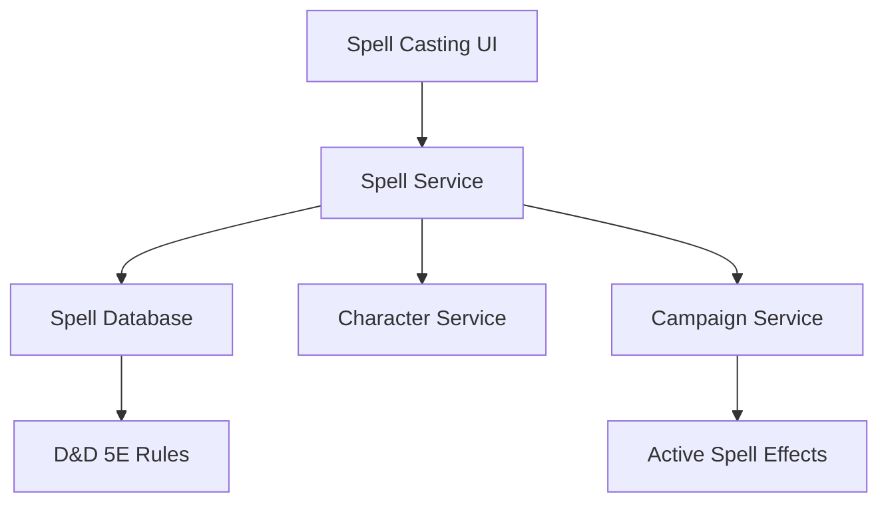

# Product Requirements Document: Spell Casting System

## PRD-SCS-001

**Version:** 1.0  
**Date:** December 2024  
**Author:** AI Assistant  
**Status:** Draft  

---

## Executive Summary

This PRD outlines the requirements for implementing a comprehensive spell casting system that enables players to cast spells during D&D 5E gameplay. The system will provide an intuitive interface for spell selection, component management, and integration with the AI Dungeon Master for spell resolution and narrative integration.

## Business Objectives

- Enable players to cast spells with accurate D&D 5E mechanics
- Provide clear spell information and component tracking
- Support both prepared and spontaneous spellcasters
- Integrate spellcasting with combat and roleplay systems
- Create an immersive spellcasting experience

## Success Metrics

- **Rule Accuracy:** 100% compliance with D&D 5E spellcasting rules
- **User Experience:** > 90% user satisfaction with spellcasting interface
- **Casting Speed:** Average spell casting completion in < 45 seconds
- **Error Rate:** < 2% user-reported spell calculation errors

---

## Detailed Requirements

### 1. Functional Requirements

#### 1.1 Spell Selection and Management
- **SCS-FR-001:** Organized spell list by level and class
- **SCS-FR-002:** Prepared spell management for spellcasters
- **SCS-FR-003:** Cantrip access with unlimited usage
- **SCS-FR-004:** Spell search and filtering by various criteria
- **SCS-FR-005:** Spell bookmarking for frequently used spells

#### 1.2 Spell Information Display
- **SCS-FR-006:** Complete spell details (level, school, casting time, range, components, duration)
- **SCS-FR-007:** Spell descriptions with formatting and readability
- **SCS-FR-008:** Damage/healing calculations and scaling
- **SCS-FR-009:** Area of effect visualization
- **SCS-FR-010:** Spell component requirements and availability

#### 1.3 Spell Slot Management
- **SCS-FR-011:** Spell slot tracking by level with visual indicators
- **SCS-FR-012:** Slot expenditure and recovery tracking
- **SCS-FR-013:** Warlock invocation and pact magic slot handling
- **SCS-FR-014:** Sorcerer point and flexible casting support
- **SCS-FR-015:** Spell slot warnings for low availability

#### 1.4 Casting Mechanics
- **SCS-FR-016:** Component verification (verbal, somatic, material)
- **SCS-FR-017:** Range and targeting validation
- **SCS-FR-018:** Concentration spell tracking and management
- **SCS-FR-019:** Ritual casting support
- **SCS-FR-020:** Counterspell mechanics

#### 1.5 Spell Effects and Duration
- **SCS-FR-021:** Active spell effect tracking
- **SCS-FR-022:** Duration countdown and expiration
- **SCS-FR-023:** Concentration checks for sustained spells
- **SCS-FR-024:** Dispel magic mechanics
- **SCS-FR-025:** Spell interaction and stacking rules

#### 1.6 User Experience
- **SCS-FR-026:** Quick cast buttons for prepared spells
- **SCS-FR-027:** Spell casting animations and feedback
- **SCS-FR-028:** Mobile-friendly spell selection
- **SCS-FR-029:** Keyboard shortcuts for spell casting
- **SCS-FR-030:** Spell history and recent cast tracking

### 2. Technical Requirements

#### 2.1 Frontend Components
- **SCS-TR-001:** React components for spell interface
- **SCS-TR-002:** Real-time spell slot synchronization
- **SCS-TR-003:** Responsive design for mobile devices
- **SCS-TR-004:** Accessibility support for spell information

#### 2.2 Backend Integration
- **SCS-TR-005:** Spell database integration
- **SCS-TR-006:** Spell validation and rule checking
- **SCS-TR-007:** Character spell list management
- **SCS-TR-008:** Campaign spell effect tracking

#### 2.3 Performance Requirements
- **SCS-TR-009:** < 300ms spell search response time
- **SCS-TR-010:** Real-time spell slot updates
- **SCS-TR-011:** Efficient spell effect calculations
- **SCS-TR-012:** Minimal memory usage for spell data

---

## User Stories

### Primary User Stories

**As a spellcaster,** I want to easily select and cast spells so that I can use my magical abilities during gameplay.

**As a spellcaster,** I want to track my spell slots so that I know how many spells I can cast.

**As a spellcaster,** I want to see detailed spell information so that I understand what each spell does.

**As a spellcaster,** I want to manage my prepared spells so that I can adapt to different situations.

**As a DM,** I want to see when players cast spells so that I can narrate the effects appropriately.

### Secondary User Stories

**As a spellcaster,** I want to see spell components required so that I know what I need to cast them.

**As a spellcaster,** I want to track concentration spells so that I don't accidentally lose them.

**As a spellcaster,** I want quick access to my most-used spells so that I can cast them quickly in combat.

**As a spellcaster,** I want to see spell ranges and areas so that I can target them effectively.

**As a DM,** I want to know about spell durations so that I can track ongoing effects.

---

## Technical Specifications

### Architecture



### Data Models

#### Spell Structure
```typescript
interface Spell {
  id: string;
  name: string;
  level: number;
  school: SpellSchool;
  castingTime: string;
  range: string;
  components: SpellComponents;
  duration: string;
  concentration: boolean;
  ritual: boolean;
  description: string;
  higherLevelDescription?: string;
  damage?: SpellDamage;
  healing?: SpellHealing;
  areaOfEffect?: AreaOfEffect;
  savingThrow?: SavingThrow;
  spellAttack?: boolean;
  classes: string[];
  source: string;
}

interface SpellComponents {
  verbal: boolean;
  somatic: boolean;
  material?: MaterialComponent;
}

interface MaterialComponent {
  description: string;
  cost?: number;
  consumed: boolean;
}

interface SpellDamage {
  dice: string;
  type: DamageType;
  scaling?: SpellScaling;
}

interface ActiveSpell {
  id: string;
  spellId: string;
  characterId: string;
  campaignId: string;
  casterId: string;
  targetIds: string[];
  slotLevel: number;
  concentration: boolean;
  remainingDuration: number; // in rounds or minutes
  effects: SpellEffect[];
  castAt: Date;
  expiresAt?: Date;
}
```

#### Character Spell Data
```typescript
interface CharacterSpells {
  characterId: string;
  spellcastingAbility: string;
  spellcastingModifier: number;
  spellSaveDC: number;
  spellAttackModifier: number;
  cantripsKnown: Spell[];
  spellsKnown: Spell[];
  spellsPrepared: Spell[];
  spellSlots: SpellSlots;
}

interface SpellSlots {
  1: SlotInfo;
  2: SlotInfo;
  3: SlotInfo;
  4: SlotInfo;
  5: SlotInfo;
  6: SlotInfo;
  7: SlotInfo;
  8: SlotInfo;
  9: SlotInfo;
}

interface SlotInfo {
  total: number;
  used: number;
  available: number;
}
```

### API Endpoints

#### Spell Management
- `GET /api/characters/:id/spells` - Get character spells
- `POST /api/characters/:id/spells/prepare` - Prepare/unprepare spell
- `GET /api/spells` - Search spells database
- `GET /api/spells/:id` - Get spell details

#### Spell Casting
- `POST /api/campaigns/:id/spells/cast` - Cast a spell
- `GET /api/campaigns/:id/spells/active` - Get active spells
- `POST /api/campaigns/:id/spells/:spellId/dispel` - Dispel a spell
- `POST /api/campaigns/:id/spells/concentration-check` - Perform concentration check

#### Spell Slots
- `GET /api/characters/:id/spell-slots` - Get spell slot status
- `POST /api/characters/:id/spell-slots/:level/use` - Use spell slot
- `POST /api/characters/:id/spell-slots/:level/recover` - Recover spell slot
- `POST /api/characters/:id/spell-slots/reset` - Reset all spell slots

---

## Implementation Plan

### Phase 1: Spell Database and Display (Week 1-2)
1. Implement spell data models and database
2. Create spell search and display components
3. Build spell information interface
4. Develop spell slot tracking system

### Phase 2: Casting Mechanics (Week 3)
1. Implement spell casting workflow
2. Add component verification
3. Create spell slot expenditure system
4. Develop concentration tracking

### Phase 3: Advanced Features (Week 4)
1. Active spell effect management
2. Duration and expiration tracking
3. Spell interaction mechanics
4. Mobile optimization

### Phase 4: Integration and Testing (Week 5)
1. Campaign integration
2. Real-time synchronization
3. Performance testing
4. User acceptance testing

---

## Acceptance Criteria

### Functional Acceptance Criteria
- [ ] Spells can be searched, viewed, and selected
- [ ] Spell slots are tracked and updated correctly
- [ ] Spell casting follows D&D 5E rules
- [ ] Component requirements are verified
- [ ] Concentration spells are tracked properly
- [ ] Active spell effects are managed correctly

### Technical Acceptance Criteria
- [ ] Spell search responds in < 300ms
- [ ] Real-time updates work for spell slot changes
- [ ] Spell calculations are 100% accurate
- [ ] Memory usage remains efficient
- [ ] Mobile interface is fully functional

### Quality Assurance Criteria
- [ ] Unit test coverage > 90% for spell calculations
- [ ] Integration tests for spell casting workflows
- [ ] Manual testing with various spellcaster builds
- [ ] Performance testing with large spell lists

---

## Dependencies

### External Dependencies
- **D&D 5E SRD:** Official spell and spellcasting rules
- **Spell Database:** Comprehensive spell data source

### Internal Dependencies
- **Character Service:** For spellcaster data
- **Campaign Service:** For spell effect tracking
- **Real-time System:** For live spell updates

### Risks and Mitigations

#### Risk: Complex spell interaction rules
**Mitigation:** Comprehensive rule validation and testing

#### Risk: Performance with large spell databases
**Mitigation:** Efficient search indexing and caching

#### Risk: Mobile spell selection challenges
**Mitigation:** Touch-optimized interface design

---

## Testing Strategy

### Unit Testing
- Spell slot calculations
- Spell component validation
- Concentration mechanics
- Duration tracking

### Integration Testing
- Complete spell casting workflow
- Spell effect integration
- Real-time synchronization
- Campaign spell tracking

### User Acceptance Testing
- Spellcasting usability testing
- Various spellcaster class testing
- Performance with spell-heavy campaigns
- Mobile compatibility

### Performance Testing
- Spell search performance
- Large spell list handling
- Real-time update latency
- Memory usage with active spells

---

## Success Metrics and KPIs

### Technical KPIs
- **Accuracy:** 100% compliance with D&D 5E rules
- **Performance:** < 300ms spell search and < 500ms casting
- **Reliability:** 99.9% successful spell resolutions
- **Scalability:** Support 1000+ spells in database

### Business KPIs
- **User Engagement:** Increased spellcasting frequency
- **User Satisfaction:** > 90% satisfaction with spell system
- **Feature Usage:** 95% of spellcasters use the system
- **Error Rate:** < 2% user-reported spell issues

---

## Future Considerations

### Phase 2 Features (Post-MVP)
- Spell creation and customization
- Spell combo system
- Magical item spell integration
- Spell research and discovery
- Advanced spell effects visualization

### Advanced Features
- Spell optimization recommendations
- Spell casting analytics
- Collaborative spell design
- Spell effect prediction
- Integration with external spell databases

---

## Approval and Sign-off

**Product Manager:** [To be assigned]  
**Technical Lead:** [To be assigned]  
**QA Lead:** [To be assigned]  
**Design Lead:** [To be assigned]

**Approval Date:** [Date]  
**Target Launch Date:** [Date + 5 weeks]
