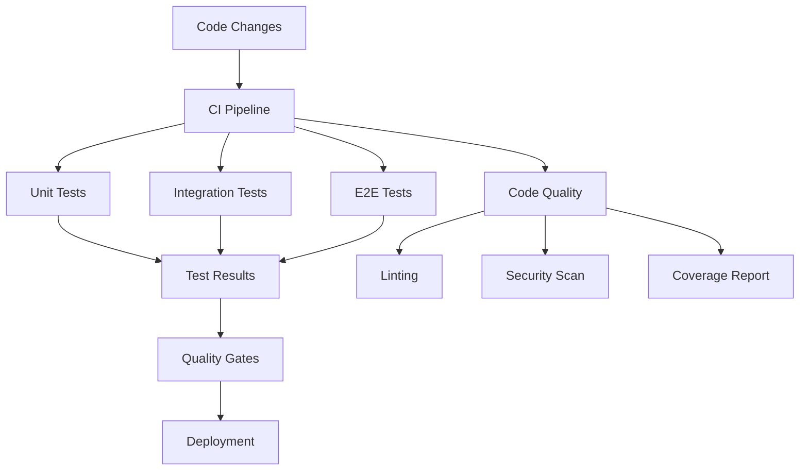

# Product Requirements Document: Testing Infrastructure

## PRD-TST-001

**Version:** 1.0  
**Date:** December 2024  
**Author:** AI Assistant  
**Status:** Draft  

---

## Executive Summary

This PRD outlines the requirements for implementing a comprehensive testing infrastructure that ensures code quality, reliability, and maintainability for the D&D LLM Game Client. The system will provide automated testing, continuous integration, and quality assurance processes to support rapid development and deployment.

## Business Objectives

- Ensure high code quality and reliability
- Reduce bugs and regressions in production
- Enable rapid and confident deployments
- Support scalable development team growth
- Maintain consistent code standards across the project

## Success Metrics

- **Code Coverage:** > 80% overall test coverage
- **Test Execution:** < 10 minutes for full test suite
- **Bug Detection:** 95% of bugs caught by automated tests
- **Deployment Confidence:** > 99% successful deployments

---

## Detailed Requirements

### 1. Functional Requirements

#### 1.1 Unit Testing Framework
- **TST-FR-001:** Comprehensive unit test suite for all components
- **TST-FR-002:** Test coverage reporting and tracking
- **TST-FR-003:** Automated test execution on code changes
- **TST-FR-004:** Mock and stub utilities for external dependencies
- **TST-FR-005:** Test data generation and fixtures

#### 1.2 Integration Testing
- **TST-FR-006:** API endpoint testing with realistic data
- **TST-FR-007:** Database integration testing
- **TST-FR-008:** External service integration testing
- **TST-FR-009:** End-to-end workflow testing
- **TST-FR-010:** Cross-component interaction testing

#### 1.3 Frontend Testing
- **TST-FR-011:** Component unit testing with React Testing Library
- **TST-FR-012:** User interaction testing
- **TST-FR-013:** UI state management testing
- **TST-FR-014:** Accessibility testing integration
- **TST-FR-015:** Visual regression testing

#### 1.4 Backend Testing
- **TST-FR-016:** API route testing with various scenarios
- **TST-FR-017:** Database operation testing
- **TST-FR-018:** Authentication and authorization testing
- **TST-FR-019:** Error handling and edge case testing
- **TST-FR-020:** Performance and load testing

#### 1.5 Continuous Integration
- **TST-FR-021:** Automated test execution on pull requests
- **TST-FR-022:** Build verification and artifact generation
- **TST-FR-023:** Code quality gate enforcement
- **TST-FR-024:** Automated deployment pipelines
- **TST-FR-025:** Environment-specific testing

#### 1.6 Code Quality Tools
- **TST-FR-026:** Static code analysis and linting
- **TST-FR-027:** Code formatting and style consistency
- **TST-FR-028:** Security vulnerability scanning
- **TST-FR-029:** Dependency vulnerability checking
- **TST-FR-030:** Performance profiling and monitoring

### 2. Technical Requirements

#### 2.1 Testing Frameworks
- **TST-TR-001:** Jest for JavaScript/TypeScript testing
- **TST-TR-002:** React Testing Library for component testing
- **TST-TR-003:** Supertest for API testing
- **TST-TR-004:** Playwright for end-to-end testing
- **TST-TR-005:** Cypress for integration testing

#### 2.2 Test Infrastructure
- **TST-TR-006:** Test database isolation
- **TST-TR-007:** Mock servers for external APIs
- **TST-TR-008:** Test data seeding and cleanup
- **TST-TR-009:** Parallel test execution
- **TST-TR-010:** Test result reporting and analytics

#### 2.3 CI/CD Integration
- **TST-TR-011:** GitHub Actions workflow integration
- **TST-TR-012:** Automated test execution on commits
- **TST-TR-013:** Pull request validation
- **TST-TR-014:** Deployment gate controls
- **TST-TR-015:** Rollback testing and verification

#### 2.4 Monitoring and Reporting
- **TST-TR-016:** Test execution time tracking
- **TST-TR-017:** Test failure analysis and reporting
- **TST-TR-018:** Code coverage visualization
- **TST-TR-019:** Quality metrics dashboard
- **TST-TR-020:** Alert system for test failures

---

## User Stories

### Primary User Stories

**As a developer,** I want automated tests to run on every code change so that I can catch bugs early in development.

**As a developer,** I want clear test coverage reports so that I know which parts of the code need more testing.

**As a developer,** I want fast test execution so that I don't waste time waiting for tests to complete.

**As a product manager,** I want confidence in deployments so that I can release features without fear of breaking existing functionality.

**As a QA engineer,** I want comprehensive testing tools so that I can validate complex user workflows.

### Secondary User Stories

**As a developer,** I want code quality tools to enforce standards so that the codebase remains maintainable.

**As a developer,** I want helpful error messages when tests fail so that I can quickly identify and fix issues.

**As a security officer,** I want automated security scanning so that vulnerabilities are caught before deployment.

**As a DevOps engineer,** I want automated deployment pipelines so that I can focus on infrastructure rather than manual processes.

**As a team lead,** I want test analytics so that I can track team productivity and code quality trends.

---

## Technical Specifications

### Architecture



### Test Categories and Structure

#### Unit Tests
```typescript
// Example test structure
describe('Character Service', () => {
  describe('createCharacter', () => {
    it('should create a valid character', async () => {
      // Test implementation
    });
    
    it('should validate required fields', async () => {
      // Test implementation
    });
    
    it('should handle database errors', async () => {
      // Test implementation
    });
  });
});
```

#### Integration Tests
```typescript
// API integration test example
describe('Character API', () => {
  it('should create character via API', async () => {
    const response = await request(app)
      .post('/api/characters')
      .send(validCharacterData)
      .expect(201);
    
    expect(response.body).toHaveProperty('id');
  });
});
```

#### End-to-End Tests
```typescript
// E2E test example with Playwright
test('complete character creation workflow', async ({ page }) => {
  await page.goto('/characters/create');
  await page.fill('[data-testid="name-input"]', 'Test Character');
  await page.selectOption('[data-testid="race-select"]', 'Elf');
  await page.click('[data-testid="create-button"]');
  await expect(page).toHaveURL(/\/characters\/\d+/);
});
```

### Test Configuration

#### Jest Configuration
```javascript
// jest.config.js
module.exports = {
  testEnvironment: 'jsdom',
  setupFilesAfterEnv: ['<rootDir>/src/setupTests.ts'],
  collectCoverageFrom: [
    'src/**/*.{ts,tsx}',
    '!src/**/*.d.ts',
    '!src/index.tsx',
    '!src/serviceWorker.ts'
  ],
  coverageThreshold: {
    global: {
      branches: 80,
      functions: 80,
      lines: 80,
      statements: 80
    }
  }
};
```

#### Test Database Setup
```typescript
// Test database configuration
export const testDbConfig = {
  database: ':memory:',
  logging: false,
  synchronize: true,
  dropSchema: true
};
```

### CI/CD Pipeline Configuration

#### GitHub Actions Workflow
```yaml
# .github/workflows/ci.yml
name: CI
on: [push, pull_request]

jobs:
  test:
    runs-on: ubuntu-latest
    steps:
      - uses: actions/checkout@v3
      - uses: actions/setup-node@v3
        with:
          node-version: '18'
      - run: npm ci
      - run: npm run lint
      - run: npm run test:unit
      - run: npm run test:integration
      - run: npm run build
```

### API Endpoints

#### Test Management
- `GET /api/tests/coverage` - Get test coverage report
- `GET /api/tests/results` - Get test execution results
- `POST /api/tests/run` - Trigger test execution
- `GET /api/tests/status` - Get current test status

#### Quality Metrics
- `GET /api/quality/coverage` - Get coverage metrics
- `GET /api/quality/issues` - Get code quality issues
- `GET /api/quality/trends` - Get quality trends over time
- `POST /api/quality/scan` - Trigger quality scan

---

## Implementation Plan

### Phase 1: Core Testing Framework (Week 1-2)
1. Set up Jest and testing libraries
2. Create basic test structure and utilities
3. Implement unit testing for core services
4. Add test coverage reporting

### Phase 2: Integration Testing (Week 3)
1. Implement API testing framework
2. Create database testing utilities
3. Add integration tests for key workflows
4. Set up test data management

### Phase 3: Frontend Testing (Week 4)
1. Implement React component testing
2. Add user interaction tests
3. Create accessibility testing
4. Build visual regression testing

### Phase 4: CI/CD and Quality (Week 5)
1. Set up GitHub Actions workflows
2. Implement code quality tools
3. Add security scanning
4. Create monitoring and reporting

---

## Acceptance Criteria

### Functional Acceptance Criteria
- [ ] Unit tests cover > 80% of code
- [ ] Integration tests validate key workflows
- [ ] E2E tests cover critical user journeys
- [ ] CI pipeline runs on all pull requests
- [ ] Code quality gates prevent poor code
- [ ] Test execution completes in < 10 minutes

### Technical Acceptance Criteria
- [ ] Test framework integrates with existing codebase
- [ ] Test isolation prevents interference
- [ ] Test utilities are reusable and maintainable
- [ ] Coverage reports are accurate and useful
- [ ] CI/CD pipeline is reliable and fast
- [ ] Test failures provide clear diagnostic information

### Quality Assurance Criteria
- [ ] Test suite catches realistic bugs
- [ ] Tests are maintainable and not brittle
- [ ] Test data is realistic and comprehensive
- [ ] Performance tests identify bottlenecks
- [ ] Security tests catch common vulnerabilities
- [ ] Accessibility tests ensure inclusive design

---

## Dependencies

### External Dependencies
- **Jest:** Testing framework
- **React Testing Library:** Component testing
- **Supertest:** API testing
- **Playwright:** End-to-end testing
- **ESLint:** Code linting
- **Prettier:** Code formatting

### Internal Dependencies
- **Project Structure:** Well-organized codebase
- **Database:** Test database setup
- **API Design:** Consistent API patterns
- **Authentication:** Test user management

### Risks and Mitigations

#### Risk: Test maintenance overhead
**Mitigation:** Focus on valuable tests, use test utilities

#### Risk: Slow test execution
**Mitigation:** Parallel execution, selective test running

#### Risk: Brittle tests
**Mitigation:** Test design best practices, avoid implementation details

---

## Testing Strategy

### Unit Testing
- Service layer logic and calculations
- Component rendering and interactions
- Utility functions and helpers
- Data validation and transformation
- Error handling and edge cases

### Integration Testing
- API endpoint functionality
- Database operations and queries
- External service integrations
- Authentication and authorization
- Cross-component interactions

### End-to-End Testing
- User registration and login
- Character creation workflow
- Campaign creation and gameplay
- Combat system interactions
- Settings and configuration

### Performance Testing
- Page load times
- API response times
- Database query performance
- Memory usage patterns
- Concurrent user handling

### Security Testing
- Authentication bypass attempts
- Input validation and sanitization
- SQL injection prevention
- XSS vulnerability testing
- CSRF protection verification

---

## Success Metrics and KPIs

### Technical KPIs
- **Coverage:** > 80% code coverage across all modules
- **Execution Time:** < 10 minutes for full test suite
- **Failure Rate:** < 5% test failure rate in CI
- **Performance:** Tests complete within allocated time budgets

### Business KPIs
- **Bug Detection:** 95% of production bugs caught by tests
- **Deployment Success:** > 99% successful deployments
- **Developer Productivity:** Reduced debugging time by 50%
- **Code Quality:** Consistent code standards maintained

---

## Future Considerations

### Phase 2 Features (Post-MVP)
- Visual regression testing
- Performance regression detection
- Load testing for scalability
- Contract testing for microservices
- Chaos engineering for resilience

### Advanced Features
- AI-assisted test generation
- Test impact analysis
- Predictive test failure detection
- Test case management system
- Automated test maintenance

---

## Approval and Sign-off

**Product Manager:** [To be assigned]  
**Technical Lead:** [To be assigned]  
**QA Lead:** [To be assigned]  
**Design Lead:** [To be assigned]

**Approval Date:** [Date]  
**Target Launch Date:** [Date + 5 weeks]
