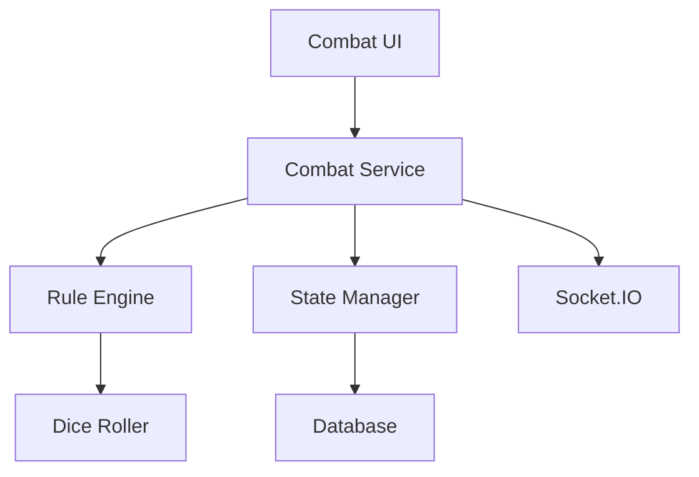

# Product Requirements Document: Turn-Based Combat System

## PRD-CBT-001

**Version:** 1.0  
**Date:** December 2024  
**Author:** AI Assistant  
**Status:** Draft  

---

## Executive Summary

This PRD outlines the requirements for implementing a comprehensive turn-based combat system that adheres to Dungeons & Dragons 5th Edition rules. The system will provide players with an intuitive interface for managing combat encounters, tracking initiative, resolving attacks, and maintaining character health.

## Business Objectives

- Deliver authentic D&D 5E combat experience with accurate rule implementation
- Provide intuitive combat interface that doesn't disrupt narrative flow
- Enable strategic gameplay through proper initiative and turn management
- Support both single-player and multiplayer combat scenarios
- Reduce player confusion with clear combat state visualization

## Success Metrics

- **Rule Accuracy:** 100% compliance with D&D 5E combat rules
- **User Experience:** > 85% user satisfaction with combat interface
- **Combat Resolution Time:** Average combat round completion in < 3 minutes
- **Error Rate:** < 5% user-reported combat calculation errors

---

## Detailed Requirements

### 1. Functional Requirements

#### 1.1 Initiative Management
- **CBT-FR-001:** Automatic initiative rolling with Dexterity modifier application
- **CBT-FR-002:** Initiative order display with current turn highlighting
- **CBT-FR-003:** Manual initiative entry for DM-controlled NPCs
- **CBT-FR-004:** Initiative tie-breaking according to D&D 5E rules
- **CBT-FR-005:** Round counter and turn progression tracking

#### 1.2 Combat Actions
- **CBT-FR-006:** Standard action types: Attack, Cast Spell, Dash, Disengage, Dodge, Help, Hide, Ready, Search, Use Object
- **CBT-FR-007:** Bonus action tracking and validation
- **CBT-FR-008:** Reaction management with opportunity attacks
- **CBT-FR-009:** Movement tracking within speed limits
- **CBT-FR-010:** Action economy visualization (action, bonus action, reaction status)

#### 1.3 Attack Resolution
- **CBT-FR-011:** Automatic attack roll calculation (d20 + ability modifier + proficiency)
- **CBT-FR-012:** Armor Class comparison and hit/miss determination
- **CBT-FR-013:** Critical hit detection (natural 20) and confirmation
- **CBT-FR-014:** Critical miss handling (natural 1)
- **CBT-FR-015:** Advantage/disadvantage mechanics with visual indicators

#### 1.4 Damage and Health Management
- **CBT-FR-016:** Damage calculation with resistance/vulnerability/immunity
- **CBT-FR-017:** Health point tracking with current/maximum values
- **CBT-FR-018:** Temporary hit points management
- **CBT-FR-019:** Death saving throws with success/failure tracking
- **CBT-FR-020:** Healing and recovery mechanics

#### 1.5 Status Effects and Conditions
- **CBT-FR-021:** D&D 5E condition tracking (blinded, charmed, deafened, etc.)
- **CBT-FR-022:** Condition duration management (rounds, minutes, saves)
- **CBT-FR-023:** Condition effect visualization on character cards
- **CBT-FR-024:** Saving throw mechanics for condition removal
- **CBT-FR-025:** Concentration checks for spellcasters

#### 1.6 Combat Visualization
- **CBT-FR-026:** Character combat cards with key stats (HP, AC, initiative)
- **CBT-FR-027:** Visual turn indicators and active participant highlighting
- **CBT-FR-028:** Combat log with detailed action descriptions
- **CBT-FR-029:** Health bar visualizations with color-coded status
- **CBT-FR-030:** Range and area effect indicators

### 2. Technical Requirements

#### 2.1 Frontend Components
- **CBT-TR-001:** React components for combat interface
- **CBT-TR-002:** Real-time state synchronization via Socket.IO
- **CBT-TR-003:** Responsive design for mobile and desktop
- **CBT-TR-004:** Accessibility compliance for screen readers

#### 2.2 Backend Logic
- **CBT-TR-005:** Combat state management and persistence
- **CBT-TR-006:** D&D 5E rule engine for calculations
- **CBT-TR-007:** Initiative order management
- **CBT-TR-008:** Damage calculation engine

#### 2.3 Data Management
- **CBT-TR-009:** Combat session state persistence
- **CBT-TR-010:** Character stat caching for performance
- **CBT-TR-011:** Combat log archiving
- **CBT-TR-012:** Multiplayer state synchronization

---

## User Stories

### Primary User Stories

**As a player,** I want to see a clear initiative order so that I know when my turn is coming up.

**As a player,** I want the system to automatically calculate my attack rolls so that I don't make math errors during combat.

**As a player,** I want to track my character's health and conditions so that I can make informed tactical decisions.

**As a player,** I want to see the results of my actions immediately so that combat flows smoothly.

**As a DM,** I want to control NPC actions and initiative so that I can manage combat encounters effectively.

### Secondary User Stories

**As a player,** I want to apply advantage/disadvantage to my rolls so that I can accurately represent situational modifiers.

**As a player,** I want to track temporary hit points separately so that I understand my true health status.

**As a player,** I want to see critical hit animations so that exciting moments feel more impactful.

**As a player,** I want to undo my last action if I made a mistake so that I don't have to restart the entire combat.

---

## Technical Specifications

### Architecture



### Data Models

#### Combat State
```typescript
interface CombatState {
  id: string;
  campaignId: string;
  isActive: boolean;
  round: number;
  turn: number;
  initiativeOrder: InitiativeEntry[];
  participants: CombatParticipant[];
  combatLog: CombatLogEntry[];
  createdAt: Date;
  updatedAt: Date;
}

interface InitiativeEntry {
  participantId: string;
  initiative: number;
  isCurrentTurn: boolean;
}

interface CombatParticipant {
  id: string;
  characterId?: string;
  npcId?: string;
  name: string;
  currentHp: number;
  maxHp: number;
  tempHp: number;
  armorClass: number;
  conditions: Condition[];
  position?: Position;
}
```

#### Combat Actions
```typescript
interface CombatAction {
  type: 'attack' | 'spell' | 'movement' | 'bonus_action' | 'reaction';
  participantId: string;
  targetId?: string;
  details: AttackDetails | SpellDetails | MovementDetails;
  timestamp: Date;
}

interface AttackDetails {
  weapon: string;
  attackRoll: DiceRoll;
  damageRoll?: DiceRoll;
  hit: boolean;
  critical: boolean;
  advantage?: boolean;
  disadvantage?: boolean;
}
```

### API Endpoints

#### Combat Management
- `POST /api/campaigns/:id/combat/start` - Initialize combat
- `POST /api/campaigns/:id/combat/end` - End combat session
- `GET /api/campaigns/:id/combat/state` - Get current combat state
- `PUT /api/campaigns/:id/combat/state` - Update combat state

#### Turn Management
- `POST /api/campaigns/:id/combat/initiative` - Roll initiative
- `POST /api/campaigns/:id/combat/next-turn` - Advance to next turn
- `PUT /api/campaigns/:id/combat/turn` - Set specific turn

#### Action Resolution
- `POST /api/campaigns/:id/combat/action` - Submit combat action
- `POST /api/campaigns/:id/combat/attack` - Resolve attack
- `POST /api/campaigns/:id/combat/damage` - Apply damage
- `POST /api/campaigns/:id/combat/heal` - Apply healing

---

## Implementation Plan

### Phase 1: Core Combat Engine (Week 1-2)
1. Implement D&D 5E rule engine
2. Create combat state management
3. Build initiative system
4. Develop basic attack resolution

### Phase 2: Frontend Combat Interface (Week 3-4)
1. Design combat UI components
2. Implement turn management
3. Add health and condition tracking
4. Create action selection interface

### Phase 3: Advanced Features (Week 5-6)
1. Status effect system
2. Advantage/disadvantage mechanics
3. Critical hit animations
4. Undo functionality

### Phase 4: Multiplayer Integration (Week 7)
1. Socket.IO combat synchronization
2. Real-time state updates
3. Multiplayer action validation
4. Combat log broadcasting

---

## Acceptance Criteria

### Functional Acceptance Criteria
- [ ] Initiative order correctly calculated and displayed
- [ ] Attack rolls automatically calculated with proper modifiers
- [ ] Hit/miss determination works according to D&D rules
- [ ] Health tracking updates correctly after damage/healing
- [ ] Turn progression works smoothly for all participants
- [ ] Status effects properly applied and tracked
- [ ] Combat can be started, managed, and ended properly

### Technical Acceptance Criteria
- [ ] Combat state persists across page refreshes
- [ ] Real-time updates work for multiplayer scenarios
- [ ] Rule calculations are 100% accurate to D&D 5E
- [ ] System handles edge cases (death saves, concentration, etc.)
- [ ] Performance remains smooth with 6+ combatants

### Quality Assurance Criteria
- [ ] Unit test coverage > 90% for combat calculations
- [ ] Integration tests for complete combat flows
- [ ] Manual testing with actual D&D scenarios
- [ ] Performance testing with large combat encounters

---

## Dependencies

### External Dependencies
- **D&D 5E SRD:** Official rule reference
- **Socket.IO:** Real-time communication (from RTC PRD)
- **Dice Rolling Library:** For complex dice calculations

### Internal Dependencies
- **Character Service:** For stat access and updates
- **Campaign Service:** For campaign context
- **Real-time Chat System:** For combat announcements

### Risks and Mitigations

#### Risk: Complex rule interactions
**Mitigation:** Comprehensive unit testing and rule validation

#### Risk: Performance issues with large combats
**Mitigation:** Efficient state management and lazy loading

#### Risk: User confusion with complex interface
**Mitigation:** User testing and iterative UI improvements

---

## Testing Strategy

### Unit Testing
- D&D 5E rule calculations
- Initiative order logic
- Damage calculation formulas
- Status effect interactions

### Integration Testing
- Complete combat flow from start to finish
- Multiplayer synchronization
- State persistence across sessions
- Real-time updates

### User Acceptance Testing
- Combat scenarios with actual D&D players
- Rule accuracy validation
- UI/UX feedback collection
- Performance testing with typical combat sizes

### Performance Testing
- Combat resolution speed
- Memory usage during extended combats
- Network latency impact
- Browser compatibility

---

## Success Metrics and KPIs

### Technical KPIs
- **Accuracy:** 100% compliance with D&D 5E rules
- **Performance:** < 2 second response time for actions
- **Reliability:** < 1% calculation errors
- **Scalability:** Support 20+ combatants in a single encounter

### Business KPIs
- **User Engagement:** Increased combat session duration
- **User Satisfaction:** > 85% positive feedback on combat system
- **Retention:** Reduced player dropout during combat
- **Feature Usage:** 90% of campaigns use the combat system

---

## Future Considerations

### Phase 2 Features (Post-MVP)
- Tactical map integration
- Area of effect visualization
- Environmental hazards
- Complex spell interactions
- Monster stat blocks integration

### Advanced Features
- Automated DM assistance
- Combat encounter builder
- Damage over time effects
- Multi-round spell effects
- Combat replay functionality

---

## Approval and Sign-off

**Product Manager:** [To be assigned]  
**Technical Lead:** [To be assigned]  
**QA Lead:** [To be assigned]  
**Design Lead:** [To be assigned]

**Approval Date:** [Date]  
**Target Launch Date:** [Date + 7 weeks]
